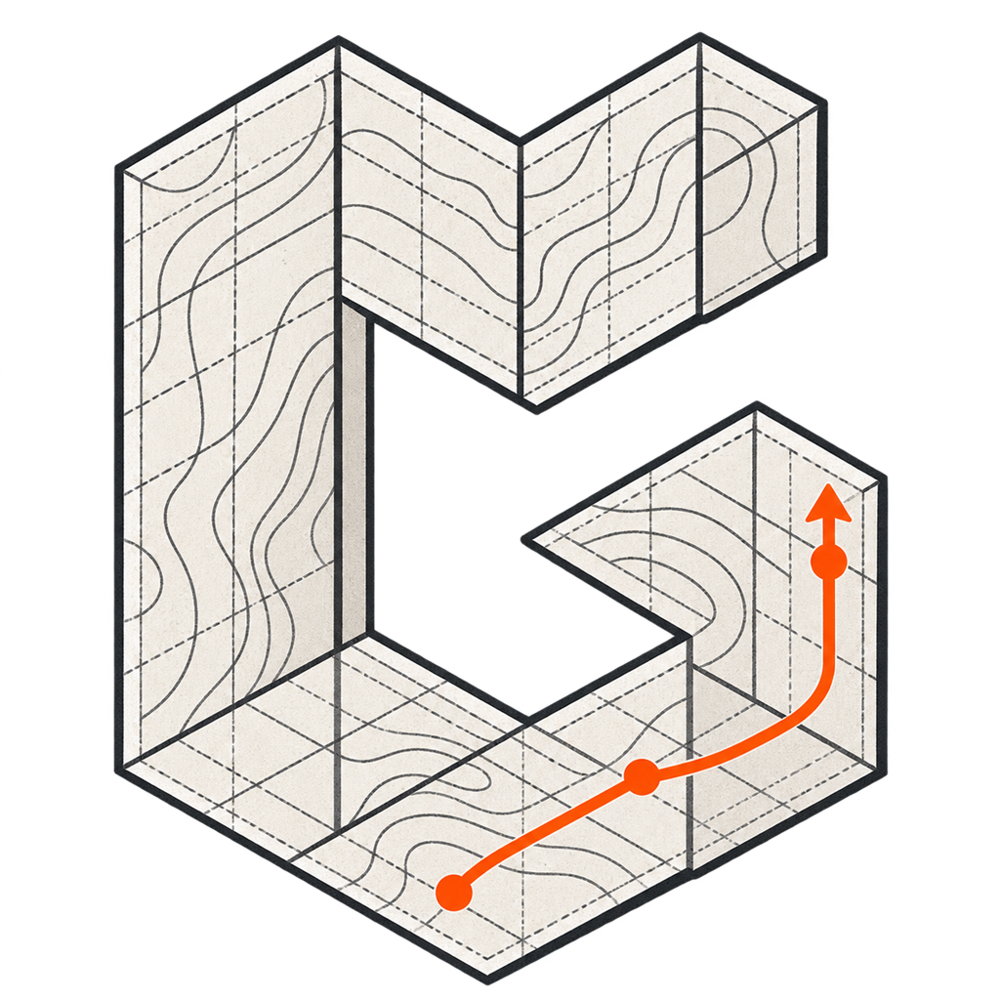
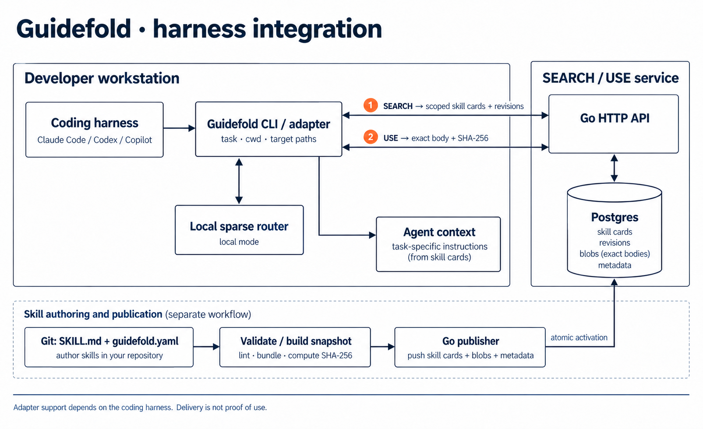
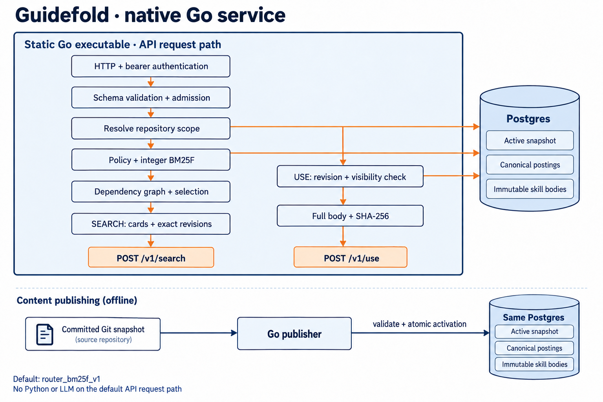

# Guidefold

Your coding agent can read the repo. Give it the instructions that apply to the code it's changing.

Guidefold keeps team guidance in Git, beside the code it governs, and selects it by task and repository location. It's built for platform teams maintaining instructions across a monorepo and multiple coding tools.

[Watch the demo](https://www.youtube.com/watch?v=e350wBr1W8c) · [Try it locally](#quickstart) · [Share feedback](https://github.com/wiatrM/guidefold/discussions/127)

## Demo

[](https://www.youtube.com/watch?v=e350wBr1W8c)

Click the image to watch the demo. The open-source CLI and native Go SEARCH/USE service are available in this repository. Paid hosting is planned; this README isn't an offer for a finished SaaS product.

## The problem

A rule for the payments service shouldn't become advice for every task in the monorepo. Yet putting all your guidance into the starting context makes that distinction hard to maintain. Separate instruction files for each coding tool create another set of copies to keep in sync.

Guidefold gives those rules a home near the code. Authors review changes in Git and validate skills in CI. At task time, the agent gets relevant cards, then loads the full instructions it needs.

A skill is a directory containing `SKILL.md`, optionally with supporting resources. Repository scope tells Guidefold where the instruction applies; the task query helps choose among eligible skills.

## Architecture

### Coding harness to instruction delivery



The CLI/adapter supplies observed workspace context. In service mode, `POST /v1/search` returns selected cards and exact revisions. `POST /v1/use` retrieves a selected revision with its checksum. The adapter is responsible for delivering that content into the coding harness.

Local routing is also available. The diagram shows integration boundaries, not identical capabilities across Claude Code, Codex and Copilot. Hook support and observation depend on the adapter and tool version. See the [harness-service contract](docs/HARNESS-SERVICE-CONTRACT.md).

A returned card is not proof that an agent read it. Loading an instruction is not proof that it helped. [Telemetry keeps those events separate](docs/SEARCH-USE-TELEMETRY.md).

### Inside the Go service



The API, migrations and publisher use one static Go executable. The default backend, `router_bm25f_v1`, reads canonical postings from Postgres and applies the reference CLI's integer BM25F scoring and selection policy. No Python interpreter or LLM sits on the default API request path.

SEARCH reads the active snapshot and resolves repository scope before selecting cards. USE checks the requested revision and visibility before returning the full body. Publishing is a separate operation: the publisher validates a committed snapshot and activates it atomically. Both database drawings represent the same Postgres instance; the horizontal request-path arrows show database access.

The [service runbook](services/search/README.md) covers deployment, database roles and verification. GPU retrieval is an [optional experimental profile](services/search/GPU.md), not a requirement for the default service.

## Quickstart

Use Python 3.10+ with PyYAML installed. Start with the fictional Meridian monorepo bundled here; it uses a local registry and needs no cloud account.

```bash
git clone https://github.com/wiatrM/guidefold.git
cd guidefold
python3 -m venv .venv
source .venv/bin/activate
python3 -m pip install pyyaml

cd examples/monorepo
G=../../skills/guidefold/scripts/guidefold

python3 "$G" validate
python3 "$G" where
python3 "$G" find "add a kafka topic with 7 day retention" --scope forge.pipelines.streaming
python3 "$G" load urn:skill:meridian:atlas.identity.turnstile:postgres-auth
```

`find` returns candidates. `load` prints the resolved `SKILL.md` path; read that file for the full instruction. These examples exercise a fixture, not evidence from a customer deployment.

To inspect the hook output:

```bash
echo '{"cwd":"'$PWD'/platforms/atlas/identity/turnstile","prompt":"add an authorization check"}' \
  | python3 "$G" hook
```

### Add Guidefold to your repository

Run this from the root of the repository you want to configure. Preview the changes first:

```bash
cd /path/to/your-monorepo
python3 /path/to/guidefold/skills/guidefold/scripts/guidefold init --dry-run
python3 /path/to/guidefold/skills/guidefold/scripts/guidefold init
python3 /path/to/guidefold/skills/guidefold/scripts/guidefold doctor
```

`init` adds the bootstrap skill, configuration and CI template, and merges hook configuration with existing settings. Use `--harness claude|copilot|codex|all` to choose the target. Review the generated configuration for your repository before relying on CI or publishing. `doctor` reports missing setup and suggested fixes.

See [skill conventions](docs/CONVENTIONS.md) for the file layout and [the bootstrap skill](skills/guidefold/SKILL.md) for the agent-facing workflow.

### Run the Go service

From the Guidefold repository root, with Docker Compose and the Python environment above:

```bash
python3 tools/search_service/dev.py deploy
```

This starts the local service at `http://127.0.0.1:8765` with Postgres and the committed Meridian fixture. Follow the [service runbook](services/search/README.md) for authenticated SEARCH/USE requests and publishing your own committed repository. The service needs its database; it does not silently switch to an in-memory body store when Postgres is unavailable.

## What's available, what's next

The repository contains the CLI, CI tooling and native Go retrieval service. Commands include `validate`, `find`, `load`, `hook`, `index`, `materialize --check` and `drift --base <ref>`.

The managed-library direction adds an owner workflow for importing, reviewing and publishing instructions. That work has a separate [architecture](docs/PIVOT-ARCHITECTURE.md) and [implementation status](docs/PIVOT-IMPLEMENTATION.md). Proposed behavior, code and real pilot evidence are different things; a screenshot doesn't establish that a feature has shipped.

## Feedback

[Start with the demo and tell us where the workflow breaks](https://github.com/wiatrM/guidefold/discussions/127).

What was the last instruction failure your team ran into? A rule from the wrong directory, a stale skill, or an instruction that was loaded but ignored? Share a small anonymized example and the coding tool involved. Please leave private code, credentials and logs out.

For reproducible bugs, [open an issue](https://github.com/wiatrM/guidefold/issues).

## Contributing

Start with [CONTRIBUTING.md](CONTRIBUTING.md). Agents working on Guidefold itself should read [AGENTS.md](AGENTS.md) and the [documentation rules](docs/DOCUMENTATION-RULES.md); these are separate from the bootstrap installed in a consumer repository.

The architecture illustrations were generated with AI and checked against the linked implementation documents. [Asset provenance and copy review](docs/reports/readme/build-notes.md).

## License

[Apache-2.0](LICENSE).
