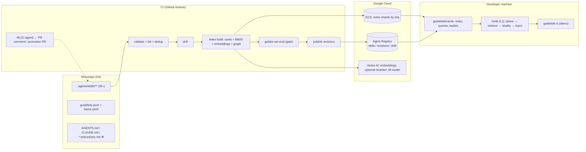

# Guidefold — Design Doc v0.3

> **Proposed MVP revision (2026-09-05):** [MVP.md](MVP.md) and [ADR-0023](adr/ADR-0023-search-use-service-and-measured-utility.md) propose central SEARCH/USE, bounded local fallback and usage/usability measurement. [ADR-0024](adr/ADR-0024-target-architecture-tiers-flywheel-composer.md) sets the target system beyond the MVP: one router contract, three deployment tiers (local, single-node, organisation), per-tenant dense admission through a telemetry flywheel, and model-based composition. Their scope and [event contract](SEARCH-USE-TELEMETRY.md) replace this document's older local-only serving, delayed telemetry, load-based probation and phase schedule for the proposed MVP. This is a plan amendment, not a claim that the service is implemented; sections explicitly describing shipped CLI behavior remain historical implementation notes.

**Status:** Draft v0.3 · 2026-09-04 · supersedes v0.2 (kept in `docs/archive/DESIGN-v0.2.md`) · **§7, §10, §11 and §13 are superseded by `docs/KNOWLEDGE-DESIGN.md`** (skills leave the code monorepo; nothing generated is committed; Knowledge API holds proposals/evidence; SkillPyramid-style induction with gates G0–G7).
**Owner:** Platform / Developer Productivity
**One-liner:** Git-native skill CI plus an evidence-based skill router for a large organization: thousands of Agent Skills of every category and level of generality, organized general → specific, validated and drift-checked in CI, distributed through Google Cloud Agent Registry, and injected into any coding harness by a deterministic, cached, hybrid-retrieval pipeline. Knowledge flows upward: CI agents lift the generic parts of specific skills into parent scopes.

Changes since v0.2: (1) the registry is storage and governance, not the router (ADR-0009 v2); (2) skills carry two axes, organizational **scope** and **kind/topics**, so generic, corporate, domain, project and AI-SDLC knowledge coexist at 2k+ scale; (3) a built **index artifact** (cards, BM25 postings, embeddings, graph) replaces per-prompt registry search; (4) retrieval is the Graph-of-Skills + SkillRouter pipeline with a **stratified general → specific budget**; (5) three-level caching; (6) **knowledge lift** is a first-class CI pipeline; (7) a **live demo UI**; (8) identity and metadata rules from ADR-0008 and ADR-0010.

---

## 1. Problem

- Thousands of `SKILL.md` files of different kinds (generic engineering, corporate policy, domain knowledge, project conventions, AI-SDLC process) and different levels of generality must reach an agent **from general to specific**, under a context budget, in four harnesses.
- Flat semantic search does not do this. On a 1,000-skill library, embedding top-k scored *below* loading everything (Graph-of-Skills, Table 1); routing on descriptions alone loses 37–44 pp of accuracy versus seeing the body (SkillRouter, Table 11). Registries, Google's included, expose only flat keyword and dense search with no scores, fusion, reranking or relations.
- Nobody knows which skill governs which code, who owns it, whether it is still true, or whether its generic parts are duplicated in twenty sibling teams.
- Knowledge is authored where it is discovered, at the bottom of the tree, and never climbs.

## 2. Goals

| # | Goal | Success signal |
|---|------|----------------|
| G1 | Skills live in Git next to the code they govern, with scope, level, kind, topics, owner, references | 100 % of published skills pass CI |
| G2 | 2,000+ skills of mixed kind and level are retrievable general → specific | Golden set: Hit@1 ≥ 0.75, Recall@8 ≥ 0.90, stratification score ≥ 0.9 on the playground; same thresholds on the real tree after onboarding |
| G3 | Injection is deterministic and fast in every harness | Hook p50 ≤ 300 ms warm, p95 ≤ 2 s, never blocks > 3 s; identical output for identical (prompt, cwd, index sha) |
| G4 | Drift and duplication are caught in the PR | "Possibly stale" and "near-duplicate" comments live |
| G5 | Generic knowledge climbs the tree | ≥ 30 % of lift proposals accepted by parent-scope owners after 3 months |
| G6 | The demo shows the graph growing and a query being ranked, live | UI shipped with Phase 1 |

## 3. Non-goals

- No own storage, IAM or versioning: Agent Registry does that (ADR-0001).
- No fine-tuned embedder or reranker before the golden set proves the deterministic pipeline insufficient (Phase 3).
- No automatic merge of lifted knowledge; humans who own the target scope approve.
- No trajectory-to-skill mining before Phase 3.

## 4. Principles

1. **Git is the source of truth. Registry and index are build artifacts.**
2. **Deterministic first, cached second, model last.** Cards and hooks are pure functions of (prompt, cwd, index sha, model outputs cached by hash). In the hook, at most one bounded model call (query rewrite + embedding) on a cache miss, with a deterministic fallback on timeout; reranking only in `find`/UI or on cache hit; everything heavier runs offline in CI.
3. **General → specific is a contract, not a quota.** The injected list is *ordered* general → specific and *closed* under `requires`/`refines`: a specific skill never arrives without the general skills it stands on. Selection itself is score-driven with per-level caps, because fixed per-level reservations are argued against by the hierarchical-retrieval literature (§8, §15).
4. **The registry stores; Guidefold decides.** Search quality comes from our index and graph; the registry's search is one optional leg.
5. **Knowledge climbs by review.** Lift is proposed by CI, accepted by owners.
6. **One script, four harnesses.** The CLI stays a single stdlib + PyYAML file; the UI is a separate optional component.

## 5. Skill model at 2k+ scale

### 5.1 Two axes and a level

| Axis | Field | Values | Bound to |
|------|-------|--------|----------|
| **Scope** | `metadata.scope` | node from `guidefold.yaml` (`_root`, `atlas.identity.turnstile`, …) | monorepo path; derived from the skill's directory |
| **Level** | derived from `scope` depth, named in `guidefold.yaml` `levels:`; a node may override with `tier:` | `enterprise` · `division` · `product` · `platform` · `domain` · `team` · `service` (L0–L6) | not authored |
| **Kind** | `metadata.kind` | one of 16 kinds in 5 families (§5.1b) | authored; allowed levels per kind validated |
| **Topics** | `metadata.topics` | comma-separated tags from a governed vocabulary (`topics.yaml`) | authored; graph edges, provider ↔ consumer matching |
| **Program** | `metadata.program` (optional) | id of a time-boxed initiative from `programs.yaml`, with `until:` | authored; expires |

#### 5.1a Levels for a large enterprise

```yaml
# guidefold.yaml (root)
levels: [enterprise, division, product, platform, domain, team, service]
nodes:
  _root:                                             # L0 enterprise  — everyone
  data-platform:                                     # L1 division    — a business unit
  data-platform.integration:                         # L2 product     — a product line / portfolio
  data-platform.integration.atlas:                   # L3 platform    — a platform or system (Atlas, Forge, Relay)
  data-platform.integration.atlas.identity:          # L4 domain      — a sub-platform / bounded context
  data-platform.integration.atlas.identity.turnstile:        # L5 team
  data-platform.integration.atlas.identity.turnstile.authz:  # L6 service / component / repo subtree
  corporate.security:                                # L1 division "corporate" is where functions live
    tier: division                                   #   (override when a subtree is shallower than the naming implies)
```

Depth is what the CLI computes; the names are what the rules below use. Shallow subtrees declare `tier:` on nodes so that, e.g., a small division whose teams sit directly under it still validates. Cross-cutting **programs** (a PCI 4.0 migration, a cloud move, a protocol rollout) are *not* levels: they are a tag with an expiry, because they cut across the tree and end.

#### 5.1b Kinds — 16 kinds in 5 families

| Family | Kind | What it is | Allowed levels | Scope-filtered? |
|--------|------|-----------|----------------|-----------------|
| **governance** | `policy` | mandatory rules: security policy, privacy, legal, licensing, export control ("must") | enterprise, division | never; always eligible |
| | `compliance` | regulatory regimes and evidence: PCI DSS, GDPR, SOC 2, accessibility | enterprise, division, product | never |
| | `security` | secure-engineering practice: secrets, threat modelling, vuln handling, hardening of a platform | enterprise, division, platform | never |
| | `architecture` | enterprise/reference architecture, ADR process, approved technologies, golden paths | enterprise, division, product, platform | never |
| **engineering** | `generic` | universal craft not specific to the company: languages, testing, git, patterns | enterprise | never |
| | `platform` | **provider skill**: how to build on an internal platform or paved road (Atlas, CI, deploy, observability); authored by the platform owner, consumed anywhere | platform, domain | never — matched by `topics` / provider ↔ consumer |
| | `integration` | **provider skill**: how to consume a system's contract: APIs, SDKs, events, partner interfaces (GDS, NDC) | product, platform, domain | never — matched by `topics` |
| | `tooling` | developer tooling and environment: CLIs, IDE setup, local stacks | enterprise, division, platform | never |
| | `data` | data governance and engineering conventions: schemas, lineage, PII handling, analytics | enterprise, division, product, platform | never |
| | `operations` | runbooks, on-call, incident and capacity procedures for a system | platform, domain, team, service | **yes** (another team's runbook governs their system) |
| **knowledge** | `domain` | business-domain knowledge: fares, PNR, ticketing, hospitality distribution | division, product, platform, domain | soft: scope proximity boost, no filter |
| | `product` | what a product does and why: behaviour, feature flags, UX rules, roadmap constraints | product, platform, domain | soft |
| | `project` | a codebase's own conventions | team, service | **yes** |
| **ways-of-working** | `process` | human SDLC: review, release trains, change management, incident process | enterprise, division, product | never |
| | `ai-sdlc` | how agents work here: planning, review, testing and release rules for agents, allowed tools, prompts, guardrails | enterprise, division, product, platform | never |
| **temporal** | `program` | time-boxed initiative guidance with `program:` id and `until:` date; expires automatically | enterprise, division, product | never; dropped after `until` |

Rules enforced by `validate`: a kind may only appear at its allowed levels; `platform`/`integration` skills must declare `topics`; `program` skills must carry `program:` and a future `until:`; `operations`/`project` skills must live under the node they govern. Defaults live in the CLI; `guidefold.yaml` may override per kind (`kinds: {policy: {levels: [enterprise]}}`) so a smaller organization can collapse the model. Every kind has an owning council for its enterprise-level content (§17 Q2).

Why provider kinds are not scope-filtered: a Atlas `platform` skill matters most to a booking team *outside* the Atlas subtree. Scope says who **maintains** a skill; `topics` and the query say who **needs** it.

Estimated composition at 2,000 skills for a the design partner-sized organization (planning figure):

| Family | Estimate | Typical authors |
|--------|----------|-----------------|
| governance (policy, compliance, security, architecture) | 250 | security, legal, architecture councils |
| engineering (generic, platform, integration, tooling, data, operations) | 800 | platform teams, SRE, DevEx, data platform |
| knowledge (domain, product, project) | 750 | product lines, domain experts, teams |
| ways-of-working (process, ai-sdlc) | 120 | engineering effectiveness, AI enablement |
| temporal (program) | 80 | program offices; churns |

### 5.2 Frontmatter (ADR-0010: every metadata value is a scalar string)

```yaml
---
name: kafka-ingestion
description: "[forge/pipelines/streaming] Building Kafka ingestion jobs … Use when … Do not use for …"
license: Apache-2.0
compatibility: "…"
metadata:
  scope: forge.pipelines.streaming
  kind: project                       # one of 16 kinds (§5.1b); level is derived from scope
  topics: "kafka, spark, streaming"   # governed vocabulary; provider skills (platform/integration) must set it
  program: ""                         # optional: id from programs.yaml, with until: "2027-03-31"
  owner: streaming-team
  requires: "urn:skill:meridian:forge.pipelines:spark-pipeline-conventions, urn:skill:meridian:forge:dataset-conventions"
  refines: "urn:skill:meridian:_root:event-streaming-basics"      # written by lift; specific → general
  replaces: ""                                                     # deprecation chain
  references: "platforms/forge/pipelines/streaming/config/topics.yaml#retentionMs"
  triggers: "kafka topic, consumer group, checkpoint, dead-letter"  # lexical anchors, boosts BM25
  status: active
  since: "2026-09-04"
  digest: >-
    Two or three sentences copied into scope cards.
---
```

`description` must contain a **trigger** ("Use when …") and a **negative trigger** ("Do not use for …"); CI lints for both, for ≥ 25 words, and for `digest`. Body ≤ 500 lines.

### 5.3 Identity (ADR-0008)

Logical URN `urn:skill:<publisher>:<scope>:<name>` everywhere in Git. Registry resource id `<publisher>--<scope dots→hyphens>--<name>`; the server prefixes `private-` and assigns the registry URN. Reverse mapping via `guidefold.yaml`.

### 5.4 The skill graph

Nodes: skills, scope nodes, topics. Edges:

| Edge | Source | Direction | Used for |
|------|--------|-----------|----------|
| `requires` | authored | specific → prerequisite | reverse-aware propagation (prerequisites gain score) |
| `refines` | lift pipeline | specific → general | stratified selection; "knowledge climbs" view |
| `replaces` | authored | new → deprecated | hide deprecated unless asked |
| `in-scope` | derived | skill → scope node → parent scope | scope proximity |
| `about` | derived from `topics` | skill ↔ topic | topic neighborhoods for generic/domain skills |
| `similar` | index build | skill ↔ skill, cosine ≥ 0.85 **and** trigram Jaccard ≥ 0.4, same or adjacent level | near-duplicate warnings; weak propagation |

`similar` edges are computed deterministically (Graph-of-Skills builds its dependency edges the same way, without an LLM). An optional CI pass may ask a model to validate `similar` edges above a threshold; validated edges get `confidence: high`.

## 6. Architecture



Components: `guidefold` CLI (single file), `guidefold-ui` (single HTML + stdlib server, optional), CI workflow, index artifact, hook templates, bootstrap skill.

**E2.6/E2.9 (shipped): the same client file at every ADR-0024 tier.** `find`/`hook`/`load` gained a
`search.backend: local|service` config (`docs/CONVENTIONS.md` §1a). `local` is today's in-process
BM25/dense Router over this document's index artifact, unchanged. `service` POSTs contract-1.1
`/v1/search` (`docs/HARNESS-SERVICE-CONTRACT.md`) to a T1 deployment (`deploy/t1/`) in a background
thread, racing it against the same local computation under **one monotonic deadline**
(ADR-0023 §3): the remote answer wins only if it validates and lands before the deadline, else the
socket is abandoned (never joined) and the local answer stands — `backend: local` opens no socket
at all, and `hook`'s config still comes from the environment only, never `guidefold.yaml` (§4
determinism, E1.5). A runtime parity counter (E2.9) hashes the ordered selected-set from both
sides whenever both finish in time and emits `telemetry_health.parity_mismatch` (hashes only) on
disagreement — the first per-query signal, outside offline eval, that T0's Python BM25F and T1's
Go/ParadeDB retrieval backend picked different skills for the same query.

## 7. Index artifact

**E1.4 (shipped):** `guidefold index` builds an immutable, sha-keyed artifact at
`<cache_root>/index/<sha>/` (`--check` rebuilds in memory and diffs every file's sha256 against
`manifest.json`, catching both a tampered artifact and a stale one — a `SKILL.md` edited without
rerunning `index`). One flat artifact per sha, no sharding yet (see "target design" below). Files:

| File | Content | Loaded |
|------|---------|--------|
| `manifest.json` | `git_sha`, `build_time` (the commit's own timestamp — reproducible; wall-clock only for the uncommitted `worktree` sha), `weights`, `student_dims`, `quant_scale`, `counts` (cards/terms/words), sha256 `checksums` of every file below | eager |
| `cards.jsonl` | one compact JSON object per doc, one line per doc, **sorted-URN order** — that order *is* the doc-id map used by `postings.bin`/`vectors.i8`/`cards.idx`. No `_body`/`requires`/`refines`: BM25 is already baked into `postings.bin` and the graph is `graph.bin` — Router never reads those two keys at query time. Never parsed whole; only the byte range `cards.idx` names for one URN is ever read (R4) | lazy, mmap |
| `cards.idx` | byte-offset table into `cards.jsonl`: `n_docs` then, per doc in sorted-URN order, `(offset uint32, length uint32)` — gives `_LazyCards` O(1) seek-and-slice access to one card's JSON line without touching another (R4, superseded eager `cards.jsonl` parsing) | eager |
| `cards.hdr` | compact per-doc header: `n_docs` then, per doc, `(urn, node, 1-byte flags)` varint-length-prefixed — `policy_filter` and closure/propagation read node/status/"has any negative_triggers" from here for every card, every query, without materializing a card body (R4) | eager |
| `graph.bin` | `requires`/`refines`/`replaces`/`similar` adjacency (`Index.graph`), one varint-encoded block per doc — mmap'd; closure/propagation only ever expands the docs a query actually touches (R4, superseded `graph.json`) | lazy, mmap |
| `graph.idx` | byte-offset table into `graph.bin`, same `(offset, length)` shape as `cards.idx`, sorted-URN order (R4) | eager |
| `nodes.json` | `guidefold.yaml`'s `nodes` map, verbatim — `cwd → node` at hook time resolves from **this**, never the working-tree `guidefold.yaml` (§4 determinism) | eager |
| `terms.bin` | global per-term integer IDF (`Index.idf`): varint-length-prefixed term + varint idf, sorted by term | eager |
| `norms.bin` | per-`(field, doc)` BM25 length norm (`Index.field_norm`): one little-endian uint32 array per field, explicit `struct.pack("<...I", ...)` — never `array.fromfile`/raw `array.array('I', ...)`, both native-order | eager |
| `postings.bin` | delta-varint doc-id postings, one contiguous block per `(field, term)` — mmap'd, only a query's own terms are ever paged in (measured: eager JSON postings 193 ms at 2k skills against the 300 ms budget; this format 0.3 ms) | lazy, mmap |
| `postings.idx` | offset+length table for `postings.bin`, sorted by `(field, term)` | eager |
| `vectors.i8` | tier-1 dense skill vectors, one `dims`-byte int8 row per doc (doc order = `cards.jsonl`); empty iff `dims == 0` | lazy, mmap |
| `words.bin` | tier-1 dense word table, one `dims`-byte int8 row per distinct word, row order = `sorted(word)`; **empty this release** — no distilled table ships yet, `manifest["student_dims"] == 0` / `weights.w_dense == 0` (ADR-0020); the format and its lazy-load path are exercised by a synthetic hand-built table in `tests/test_index_artifact.py`, never invented vectors | lazy, mmap |
| `words.idx` | vocabulary list backing `words.bin`'s row order, one word per line UTF-8 | eager |

`terms.bin`/`norms.bin`/`words.idx` are additions beyond an earlier sketch of this table (below):
that sketch didn't say where per-term IDF or per-field length norms would live on disk, and named
only the BM25 side of the lazy-postings idea. Nothing about Router's read contract changed —
`idx.idf`/`idx.field_norm`/`idx.postings`/`idx.word_vectors`/`idx.skill_vectors`/`idx.skill_normsq`
are still exactly the attributes `Router` reads; only their storage moved from "always in memory"
(`Index.build` scanning the tree, still what `find`/`materialize`/`validate` use) to "lazily
faulted in from disk" (what `hook` uses, via `load_index_artifact`).

**R4 (lazy card/graph load, 2026-09-05):** `cards.jsonl` and `graph.json` used to be parsed whole
on every hook invocation — `json.loads()` over every line / the whole file, unconditionally, cost
scaling linearly with corpus size. `graph.json` is gone from the artifact entirely (`graph.bin` +
`graph.idx` are its binary, mmap'd replacement — droppable per ADR-0021's 15MB budget since
reproducibility only needs the binary form, not a JSON mirror); `cards.jsonl` stays on disk (other
tooling still reads it, and `cards.idx`'s offsets point into it) but `load_index_artifact` no
longer parses it — `cards.hdr` covers everything `policy_filter` needs, and `cards.idx` gives
`_LazyCards` O(1) access to one card body via mmap, only when something actually asks for one.
Measured effect: ~46ms saved at 6 006 real skills. **Caveat, found while measuring R4:**
`terms.bin` + `postings.idx` (both pre-existing, both still eager, both untouched by R4) are the
*larger* remaining cost at real-corpus vocabulary sizes — ~250ms of ~271ms total load time at
6 006 skills / 89 630 terms, because they scale with vocabulary, not doc count. Full breakdown in
`docs/reports/bakeoff/R4-latency-lazy-load-2026-09-05.md`; making them lazy is a natural next step
("R5") but needs a term-keyed (not doc-id-keyed) on-disk structure, out of scope here.

**Target design (not yet built — sharding, real embeddings, CI-computed expansion):**

| Part | Content | Size at 2k skills |
|------|---------|-------------------|
| `cards.json` | urn, scope, kind, level, topics, owner, status, revision, description, digest, triggers, negative triggers, requires/refines/replaces, references | ~600 KB |
| `bm25.json` | tokenized fields with weights (name ×3, triggers ×2.5, description ×2, digest ×1.5, body keywords ×1), document lengths, idf | ~1.5 MB |
| `vec.i8` + `vec.meta` | int8-quantized embeddings, model id, dim | 2,000 × 768 B = 1.5 MB |
| `graph.json` | edges with weights | ~200 KB |
| `manifest.json` | git sha, built-at, embedding model, shard list, checksum | 1 KB |

Sharding: `global` (all `_root` skills: generic, corporate, ai-sdlc) + one shard per `L1` org. A session loads `global` + the shard of its org. Distribution: `gs://<bucket>/guidefold/index/<sha>/`; `.guidefold/index.lock` in Git pins the sha; `prewarm` fetches on session start. The registry additionally carries `hierarchy-index` (cards only, compressed ≤ 500 KB) so agents without GCS access still get the map. For `backend: local`, the index is built in memory from the tree.

Embeddings: Vertex `gemini-embedding` (or `text-embedding-005`) over `name | description | triggers | digest | first 1,500 chars of body`, computed in CI only for changed skills (hash-keyed), int8-quantized. SkillRouter's fine-tuned bi-encoder is a drop-in replacement in Phase 3.

## 8. Retrieval pipeline (the router)

> **Status after the research review, 2026-09-05:** the numbered pipeline, weights and model-serving
> choices below are a historical target sketch. The current Proposed target is
> [ADR-0022](adr/ADR-0022-admissibility-relevance-and-bundle-completeness.md), supported by the
> [architecture review](reports/bakeoff/E1.3-architecture-after-research.md). Dense, PPR, neural
> serving and sharding are conditional on measurements, not mandatory stages. At `c08c58c`,
> dense is disabled, decayed closure is the default, and the BM25F/eligibility repairs have landed.
> Explicit unresolved requirements, atomic complete bundles and shared evaluation adapters remain
> follow-up work. Earlier implementation notes and timings below describe their recorded versions.

Evidence-ranked, per query. Deterministic given (prompt, cwd, index sha) and the cached outputs of stage 1; every model-dependent stage has a deterministic fallback.

**Router 0.1 (E0.2 + E1.1, shipped):** three collaborators — `Registry`/`LocalRegistry` (storage and transport only: `publish`/`download`/`search_scope`), an `Index` (cards, field-weighted BM25 postings with precomputed integer IDF, the `requires`/`refines`/`replaces`/`similar` graph — built in memory by `Index.build()` scanning the tree for `find`/`materialize`/`validate`, or loaded lazily from the on-disk artifact by `load_index_artifact()` for `hook`, E1.4, see §7/C1 in §9; both produce the same public attributes, so `Router` cannot tell them apart), and `Router` (constructed from an `Index`, depends on it and never on `Registry`). `Router` implements a subset of the stages below, integer-only end to end so identical (prompt, cwd) is byte-identical output: stage 2 as `policy_filter` (deprecated, visibility = own subtree ∪ ancestor chain, negative triggers — hard drops with a recorded reason, never demotions); stage 3 as `candidates` (BM25 top-N ∪ dense top-N, dense channel shipped at `w_dense=0` per ADR-0020 until the E1.3 bake-off); stages 4–5 collapsed into `score` (RRF k=60 fusion of the bm25/dense ranks, an additive `w_scope/(1+hops)` scope feature — a feature and filter, never the first sort key — then reverse PPR seeded from the scope-adjusted RRF score, fixed 20 iterations, fixed-point integers); stage 7 as `select` (7b only: `requires` closure depth ≤ 2 as hard membership counting toward the `k=4` cap; 7d only: final order general → specific by depth, ties by score then urn; abstain below `abstain_threshold`). Not yet built: 1b query rewrite, 6 listwise rerank, 7a coverage backfill / 7c family caps, 8 hydration budget shaping, 9 telemetry — all still describe the target design below.

```
0  where(cwd) → scope chain [node … _root]; load global + org shard (cache C1)
1  query understanding
   1a deterministic: normalize; lexical anchors (paths, extensions, tool names, flags,
      quoted strings, YAML keys, error ids); scope tokens
   1b rewrite (one model call, cached C2, ≤ 600 ms, else skip): intent sentence +
      1–4 sub-tasks + "what kind of guidance" hints  → per-sub-task queries
2  governance filter (not a retrieval heuristic): drop status≠active unless
   `replaces` target is missing; drop expired `program` skills; drop `project` and
   `operations` skills of OTHER scopes (they govern other code; reported separately
   as "related elsewhere"); every other kind is never scope-filtered — `domain` and
   `product` get a scope-proximity boost, `platform`/`integration` are matched by
   `topics`; drop candidates whose negative triggers match the query anchors
3  seeding, per sub-task: dense top-40 (int8 cosine over the filtered set; query
   embedding cached C2, skipped on 1.5 s timeout) and BM25 top-40 (field-weighted;
   anchors boosted) → reciprocal rank fusion k=60 → union of seeds (≤ 60)
   Hybrid is for RECALL only; it never decides the final order (§15: ScaleMCP,
   SkillFlow, Dynamic ReAct show BM25 can dilute dense precision).
4  graph propagation: personalized PageRank from seeds, restart 0.2, 10 iterations;
   edge weights: requires (reverse) 1.0, refines 0.6, about 0.3, similar 0.2
5  scoring: 0.40·dense-rank + 0.25·PPR + 0.15·lexical evidence (anchor hits in
   triggers/references/expansion) + 0.10·scope proximity (exact 1.0, parent 0.8,
   grandparent 0.6, root 0.5) + 0.10·BM25-rank ; weights are golden-set-tuned
6  rerank top-20 (find/UI always; hook only on C2 hit): one listwise call with the
   cards, sub-tasks, negative triggers and scope chain in the prompt → ordering with
   SKIP allowed (compatibility logic lives here, not in the embedder)
7  selection, general → specific
   7a coverage: every sub-task from 1b gets ≥ 1 covering skill (backfill from the
      ranked list) ; 7b closure: add the one-hop requires/refines closure of every
      selected specific skill ; 7c caps by family (not reservations): governance ≤ 2,
      ways-of-working ≤ 1, engineering ≤ 2, knowledge ≤ 3, temporal ≤ 1, and ≤ 2
      per level ; a `policy`/`compliance` skill whose triggers match is never
      capped out ; 7d order by level ascending, ties by family order
      (governance → ways-of-working → engineering → knowledge → temporal), then score ;
      ≤ 8 cards of ≤ 240 chars ; hook injects ≤ 4 ; never show > 20 candidates
8  hydration (`load`): bodies of the selected specifics + closure, ≤ 12,000 chars,
   ≤ 3 full skills unless asked; summaries (digests) for the rest
9  telemetry: (query hash, scope, stage outputs, timings) → .guidefold/telemetry/*.jsonl
```

Offline, at index build (§7), each skill also gets a model-generated **expansion** (when-to-use, limitations, tags; cached by body hash) that feeds BM25 and the embedding text. Index-time expansion and CI dedup carry the strongest evidence of any stage (§15).

Why each stage exists, and what the golden set must reproduce:

| Stage | Evidence | If omitted |
|-------|----------|-----------|
| CI expansion + dedup + description lint | Tool-DE +3–7 nDCG from expanded docs; Dynamic ReAct +50 % rel. Top-5 from enrichment; two near-duplicates degrade selection 17–63 % (2601.04748); self-generated skills score *below* no skills (SkillsBench −8 to −11.5 pp); description wording changes selection > 10× (Faghih) | retrieval fights the library instead of the query |
| query rewrite into intent + sub-tasks | ToolRet: BM25 nDCG@10 22.3 → 36.5 with intent instruction; Re-Invoke +20–39 % rel.; SkillReranker +5.6 reward from decomposition; SkillRet: 3-skill queries Completeness@10 1.8 without | multi-skill prompts collapse |
| body-aware dense leg | SkillRouter −37 to −44 pp with description-only; SkillRet BM25 51.7 vs best embedder 70.3 nDCG@10 | unrecoverable downstream |
| BM25 leg, recall only | Graph-of-Skills: dropping lexical + rerank 34.4 → 26.7; Dynamic ReAct: +BM25 raises Top-10 68 → 72 but lowers Top-5; ScaleMCP: hybrid R@5 0.84 < dense 0.91 | recall loss on anchor-heavy prompts, or precision loss if fused into the final order |
| graph propagation | Graph-of-Skills 34.4 → 29.3 without; Agent-as-a-Graph R@5 0.74 → 0.85 by indexing leaves and propagating to parents; COLT completeness +25 pp | prerequisites missed |
| listwise rerank with SKIP | RankGPT nDCG@10 75.6 vs monoT5-3B 71.8; ScaleMCP LLM rerank 0.70 vs cross-encoder 0.67; R3-Skill: SKIP labels in the reranker +4.8 pp Hit@1, in the embedder −0.3 | homogeneous pools flatten (SkillRouter pointwise .433 vs listwise .740) |
| coverage backfill + small K | Group of Skills: must-hit 0.73 → 1.00 with backfill at 3.1 skills; K=5 → 2 raises choice accuracy 87 → 93 % (2605.24660); Anthropic: "degrades once you exceed 30–50 tools" | multi-intent prompts lose one intent; long lists lose the model |
| taxonomy as soft signal, not first-stage router | A2X taxonomy descent wins only with an LLM-built taxonomy and ~7k tokens + 8 calls per query; MCP-Zero's container hierarchy lost to flat dense (62.1 vs 69.1) | routing through the org tree first would lose cross-tree generic hits |
| stratified ordering + closure, caps not quotas | **unproven**: no paper measures general → specific budgets; RAPTOR/GraphRAG pool summaries and leaves in one ranked list and argue against fixed level ratios | our contribution; measured from day 1, with plain ranked top-k as the fallback |

### 8.1 Evidence base (checked 2026-09-04)

| Paper / system | Library | Technique | Headline | Takeaway |
|---|---|---|---|---|
| Graph-of-Skills 2604.05333 | 1,000 (SkillsBench) | hybrid seeds → reverse-aware PPR → lexical rerank → budgets | 34.4 vs 27.4 load-all vs 21.5 vector | propagate over dependencies; budgets |
| Group of Skills 2605.06978 | SkillsBench | group-structured retrieval + coverage backfill | 48.9 vs GoS 36.4 vs vector 25.0; must-hit 1.00 at 3.1 skills | explicit coverage stage |
| SkillRouter 2603.22455 | ~80k | body-aware bi-encoder + listwise reranker | Hit@1 .740; description-only −37–44 pp | index bodies; listwise |
| SkillRet 2605.05726 | 16,129 | benchmark, 2-level taxonomy | BM25 51.7 / best OSS 70.3 / fine-tuned 79.0 nDCG@10; Completeness@10 1.8 → 42.1 | multi-skill queries are the hard case |
| R3-Skill 2606.03565 | 10,246 (dedup from 95k) | bi-encoder + graded listwise reranker with SKIP | SKIP in reranker +4.8 pp, in embedder −0.3 | compatibility logic in the reranker |
| SkillReranker 2607.06283 | 67,884 | sub-task decomposition + cross-encoder graph | 73.1 → 78.7 reward | decompose before reranking |
| ToolRet 2503.01763 | 43k tools | benchmark; intent instruction | BM25 22.3 → 36.5; reranker 47.5 | query-side intent |
| Tool-DE 2510.22670 | ToolRet | index-time document expansion | 45.5 → 52.2 → 56.4 with reranker; `example_usage` hurts | expand offline |
| ScaleMCP 2505.06416 | 5,000 servers | dense / BM25 / hybrid / rerank | dense R@5 .91 > hybrid .84; LLM rerank .70 > CE .67 | hybrid not free; LLM rerank |
| Dynamic ReAct 2509.20386 | MCP | LLM-enriched embeddings + BM25 | Top-5/10: 40/64 → 60/68 → +BM25 56/72 | enrichment biggest lever; BM25 = recall |
| MCP-Zero 2506.01056 / A2X 2605.29270 | 2,797 tools / 1,839 services | hierarchical routing | MCP-Zero 62.1 < flat 69.1; A2X 92.6 at 7k tok + 8 calls/query | taxonomy-first only pays with an LLM in the loop |
| Tool-to-Agent 2511.01854 / Agent-as-a-Graph 2511.18194 | 527 tools | index leaves, propagate to parents, weighted RRF | R@5 .74 → .85 | leaves + propagation |
| 2601.04748 (single agent, skills) | 5–200 | flat vs 2-level selection | flat 90 % at ≤ 20 → 20 % at 200; near-duplicates −17–63 % | small K; dedup |
| SkillsBench 2602.12670 | 87 tasks | curated vs self-generated | +16.6 pp curated; self-generated −8 to −11.5 pp | curation/lint gate |
| RAPTOR 2401.18059 / GraphRAG 2404.16130 / HiRAG 2503.10150 | documents | summary trees | collapsed tree > traversal; C0 summaries 2.6 % tokens, 72 % wins | pool levels by score |
| RankGPT 2304.09542; Bruch 2210.11934 | TREC/BEIR | listwise LLM; fusion | GPT-4 75.6 vs monoT5 71.8; tuned convex > RRF(60) | one listwise call; RRF as untuned default |
| Faghih 2505.18135; SameCapRisk 2606.10388 | competing tools | description edits; sibling disambiguation | > 10× usage shift; harmful-sibling@3 .35 → .13 with contract-aware rerank | lint wording; negatives in rerank |
| Anthropic tool search (docs) | ≤ 10,000 deferred | BM25/regex, `defer_loading` | 49 → 74 % (Opus 4); degrades past 30–50 tools | progressive disclosure baseline |

Costs and latency (third-party where marked): embeddings for 10k skills × ~2k tokens ≈ 20M tokens ≈ $3 (gemini-embedding-001) ; Vertex Ranking API ≈ $1 / 1k requests (aggregator) ; Voyage rerank-2.5 ≈ 470–495 ms p50 at K=100 (arXiv 2511.09545) ; Cohere Rerank 3.5 ≈ 80–600 ms depending on measurement ; int8 embeddings retain 91–97 % quality, mainly a shard-size win.


## 9. Caching

All cache paths live under one `cache_root`: `$GUIDEFOLD_CACHE` if set, else `~/.cache/guidefold` (not `.guidefold/cache` inside the repo — the cache is per-machine, not per-checkout, and both trees below are immutable: entries are evicted, LRU by directory mtime against a configured cap, never invalidated in place).

| Level | Key | Store | TTL / invalidation | Hit path |
|-------|-----|-------|--------------------|----------|
| C1 index artifact | index sha | `<cache_root>/index/<sha>/` | LRU eviction (cap `cache.max_index_shas`, default 20); path/eviction helpers shipped in E1.7, the writer/reader (`write_index_artifact`/`load_index_artifact`, `guidefold index [--check]` / `guidefold hook`) shipped in E1.4 — one flat artifact per sha, no sharding yet (§7). `find`/`materialize`/`validate` still rebuild an in-memory `Index` from the tree every invocation; only `hook` reads the cached artifact | load ≤ 150 ms once populated |
| C2 query | sha256(normalized prompt) + index sha | *(not implemented — Router 0.1 has no model-dependent stage to cache; deferred until 1b/6 below land)* | LRU 2,000, TTL 7 d | embedding + rerank skipped |
| C3 bodies | urn + revision | `<cache_root>/skills/<urn>/<rev>/` (urn percent-encoded: `%`→`%25` then `:`→`%3A`, so it round-trips and stays filesystem-safe) | LRU eviction (cap `cache.max_skill_revisions`, default 500) | `load` offline |
| C4 registry (fallback leg) | query + location | in C2 | TTL 1 h | only when embeddings unavailable |

Hook budget: warm p50 ≤ 300 ms (index load + BM25 + local dense + PPR); cold ≤ 2 s (one embedding call); a hard SIGALRM watchdog (E1.5, default 3 s, `$GUIDEFOLD_HOOK_TIMEOUT_S` overrides) prints **nothing** and exits 0 on expiry — injecting late or from stale state is worse than injecting nothing — and appends one `hook_timeout` record to `.guidefold/telemetry/hook.jsonl` so timeouts are visible without ever reaching stdout; timed-out runs are excluded from the determinism claim in §4. Registry calls never sit on the hook path except as the C4 fallback; `gcloud` subprocess (≈ 3 s per call) is replaced by REST with a cached access token for `load` and `publish`.

## 10. Context delivery per harness (unchanged layers, new content)

| Layer | Mechanism | v0.3 change |
|-------|-----------|-------------|
| L0 scope cards | generated `AGENTS.md` chain, `*.instructions.md` with `applyTo`, `CLAUDE.md`/`GEMINI.md` = `@AGENTS.md` | cards are stratified: governance and ways-of-working digests first, then provider skills (`platform`/`integration`) whose `topics` match the node, then the chain; byte cap 6 KB per card for Codex's 32 KiB chain limit |
| L1 hook | `guidefold hook` on `UserPromptSubmit`/`SessionStart` (Claude Code, Codex); Gemini CLI JSON envelope; Copilot `sessionStart` `additionalContext` | the router of §8 with caches of §9 |
| L2 load | `guidefold load <urn>` | C3 cache; REST download |

## 11. Knowledge lift (specific → general)

Trigger: a PR adds or changes a skill at level ≥ L2. CI runs `guidefold lift`, a model-backed step (Gemini on Vertex, temperature 0, fixed prompt, JSON output), with deterministic pre- and post-processing:

1. **Segment** the body into units (headings, steps, bullets).
2. **Classify** each unit's generality: `project | team | platform | org | universal` and kind; the model sees the unit, the skill's scope chain, and the ancestor digests.
3. **Match** each unit against ancestor skills and topic neighbors at unit granularity (BM25 + dense over ancestor bodies, built on the fly; the set is small).
4. **Decide** per unit: `keep` (specific), `link` (already covered above → replace with `requires`), `lift` (general, uncovered → belongs to scope X), `conflict` (contradicts an ancestor).
5. **Emit**: always a PR comment ("3 units look org-wide; 1 contradicts `security-baseline` §Verify"); in Phase 2 also a **promotion PR** to the target scope: new or amended parent skill with `lifted_from: <urn>@<sha>` provenance, and a follow-up patch to the leaf adding `refines:` and replacing lifted text with a link. Reviewers = CODEOWNERS of the target scope. Label `guidefold-lift`.
6. **Guardrails**: never auto-merge; ≤ 5 lifted units per PR; lifted skills must pass the same lint; a rejected lift is remembered (unit hash) and not re-proposed for 90 days; conflicts block publish until resolved or waived by both owners.
7. **Consolidation** (nightly): `similar` clusters at the same level → merge proposals; acceptance and rejection are logged as metrics (G5).

The graph makes lift visible: `refines` edges accumulate upward, and the UI's "lift view" animates them.

## 12. Demo UI

`guidefold ui` starts a stdlib `http.server` on localhost with Server-Sent Events and serves one static HTML page (d3 from cdnjs; no build step). Data: the index, `.guidefold/telemetry/*.jsonl`, and a file watcher on `.agents/skills/**`.

| View | Shows | Live source |
|------|-------|-------------|
| **Graph** | scope tree (radial), skills as leaves colored by kind, topic clusters, `requires`/`refines`/`similar` edges; "history replay" rebuilds the index per commit and animates growth | file watcher + git log |
| **Query playground** | prompt + cwd picker → each stage of §8 as a column: filtered set, BM25 top-40, dense top-40, RRF seeds, PPR heat on the graph, rerank, stratified buckets, final injected cards with scores and ms per stage | runs the CLI in-process |
| **Live injections** | every real hook invocation on this machine (or a shared telemetry bucket in the demo) as a feed: scope, prompt hash, cards injected | telemetry tail |
| **Lift** | promotion proposals flowing upward, accepted vs rejected | CI comments via GitHub API (demo: fixture JSON) |

Demo script (Phase 1): open the playground on the Meridian tree → add a skill under `atlas.identity.turnstile` → graph grows → type "add an authorization check to the turnstile postgres path" from that directory → watch BM25/dense/PPR light up `postgres-auth`, then `rbac-policies` and `postgres-production` via `requires`, then `security-baseline` (corporate) fill the general bucket → the final list reads general → specific → run the same prompt in Claude Code and see the identical `[guidefold]` lines.

## 13. CI pipeline

PR: `validate` (frontmatter, kind-per-level, triggers, digest, references, requires exist, no cycles, flattened-node collisions, ZIP limits) → `dedup` (trigram Jaccard ≥ 0.6 same level → warn; ≥ 0.85 → fail) → `drift` → `materialize --check` → `index --check` (index builds; sha in lock file) → `eval` (golden set on the fixture in this repo; on the consumer tree, the consumer's golden set) → `lift` comment.
Main: `index` (embeddings for changed skills) → upload shards to GCS → `publish --changed` → `hierarchy-index` revision → `materialize` commit-back.

**E7.5 (shipped, standalone CLI form — not yet tied to an index/snapshot build, `dedup`/`lift` remain unbuilt):** `guidefold eval --queries <dir|yaml|jsonl> [--baseline b.json] [--gate]` runs the golden/consumer query set through the real product path (`policy_filter → candidates → score → select`, never a second ranking implementation) and reports the RETRIEVAL metrics (hit@1/recall@k/nDCG@10, `Router.score` order) and INJECTION metrics (completeness@k/all_required@k/distractor_rate@k plus abstention/coverage, the ≤k cards `Router.select` emits) of §8.1's evidence base. `--gate` fails the check when a gated metric regresses beyond its `guidefold.yaml` `eval.gate` margin versus `--baseline`, printing a paired bootstrap 95% CI for context; `--write-baseline` records a new baseline deliberately, the same reviewed act as `run_golden.py --update-baseline`. Wired as this repo's own `golden-eval` CI step and as `templates/ci.yml`'s `quality-gate` job for a consumer monorepo — see `docs/CONVENTIONS.md` §13.

Golden set: ≥ 60 queries on the playground, each with expected URNs and expected order by level; metrics Hit@1, Recall@8, stratification score (fraction of adjacent pairs in non-decreasing level), p50/p95 latency. Thresholds gate merges to the CLI; nightly run against the real registry detects embedder or API changes.

## 14. Registry, index and model responsibilities

| Concern | Owner | Why |
|---------|-------|-----|
| immutable revisions, IAM, audit, first-party skills, future ADK consumption | Agent Registry | commodity, governed by Google |
| hierarchy, ownership, drift, dedup, lift | Guidefold CI | not in any registry |
| candidates, fusion, propagation, stratification, caching | Guidefold CLI (index) | must be deterministic and local |
| dense query embedding, optional listwise rerank, lift classification | Vertex AI models | cached / offline / on explicit request |
| semantic search API | Agent Registry | fallback leg only |

## 15. Prior art — what already exists (checked 2026-09-04)

| Guidefold feature | Existing solutions | Status |
|-------------------|--------------------|--------|
| F1 org hierarchy of rules | nested `AGENTS.md` (OpenAI uses 88), Copilot org → repo → path `applyTo`, Claude Code `.claude/rules` with `paths:`, Kiro `fileMatch`, Continue Hub org permissions, Cursor Team Rules; **Backstage `AIContext` RFC #33575** (Mar 2026): `skill`/`rule` catalog kinds with `owner`, `lifecycle`, `dependsOn` | Directory hierarchy and precedence are **commodity**. Owned skill *entities* exist in Backstage, without retrieval or drift |
| F2 drift | **fiberplane/drift** (file + AST-symbol anchors, `drift.lock` hashes, CI gate, reverse lookup, ships as a Claude/Codex skill), agentlint.net (PR comments on stale rule references), Swimm (patented auto-sync for docs), Mintlify/Promptless | Mechanics are **commodity**; none routes the alert to the skill's owner or ties it to a hierarchy |
| F3 router | **Graph-of-Skills** open source (155★): hybrid seeding → reverse-aware PPR → rerank, MCP server, prebuilt 200–2,000-skill workspaces; **SkillRouter** released 0.6B embedder + reranker (MIT); SkillBrew, AutoSkill, Memento-Skills, SkillFlow (finds naive BM25 mixing can *dilute* dense on SkillsBench); Anthropic tool search (BM25/regex, `defer_loading`); ToolHive/vMCP hybrid search | Retrieval stack is **available**; none is scope- or ownership-aware, none delivers general → specific |
| F4 registry | Google Agent Registry / Agent Platform Skill Registry (Preview), Tessl Registry (evals + Snyk scanning), skills.sh (1.34M installs; 12 % of 2,857 audited skills malicious per Snyk), Claude Code plugin marketplaces, GitHub Agent Finder + ARD (Linux Foundation) | **Commodity**; Tessl is the closest "skills are software" lifecycle framing |
| F5 knowledge lift | Research: **SkillPyramid** (Jun 2026, "upward abstract induction" over a skill hierarchy), MSCE, XSkill (ICML 2026), CODESKILL, Socratic-SWE, EvoSkills; deployed: **SAP Shared Organizational Memory** (Jul 2026, human-gated promotion of Q&A memories); Claude Code auto-memory and Copilot Memory are repo-scoped only | Concept proven in research and in one enterprise deployment; **no product lifts SKILL.md content across org scopes in Git with owner review** |
| F6 demo UI | skill-visualizer D3 graphs, GoS workspaces | Piecemeal |
| multi-harness injection | ruler, rulesync, agent_sync, superpowers hooks | **Commodity** |

**Verdict.** Guidefold's defensible core is **F1 + F5**: an *owned* scope graph and *review-gated* upward promotion, with F2's alerts routed to owners. F3 and F4 are ingredients we should reuse, not differentiate on. Closest competitors: Graph-of-Skills (routing), fiberplane/drift + agentlint.net (drift), Backstage AIContext + Tessl (governed registry), SAP's org-memory paper (promotion). No single product combines them.

**What we reuse rather than rebuild.**
- **Graph-of-Skills**: same algorithm; we re-implement the deterministic core (BM25, RRF, PPR) in stdlib to keep the single-file CLI, and use GoS's prebuilt workspaces and SkillsBench as an external benchmark next to our golden set. Optional adapter later if their MCP server gains scope filters.
- **SkillRouter** released models: Phase 3 drop-ins for the dense leg and the reranker.
- **fiberplane/drift** anchor format (`file#symbol`, `drift.lock`): adopt in Phase 2 so `references` gain AST-symbol anchors; keep our owner routing and PR comment.
- **Backstage AIContext**: export the hierarchy and skills as catalog entities in Phase 3 so ownership shows up where platform teams already look.
- **SkillFlow's finding** that BM25 can dilute dense results is why fusion is rank-based (RRF) with weights tuned on the golden set, not a fixed linear mix.


## 16. Phasing

| Phase | Weeks | Delivers |
|-------|-------|----------|
| **0 — done** | — | fixture (17 nodes / 26 skills), CLI: where, validate, drift, materialize, index (cards), find/hook/load/prewarm on local and registry backends, 27 skills live in `guidefold-test-b6a18a` |
| **1 — router + UI** | 3 | `kind`/`topics`/`triggers` in frontmatter and validate; index artifact (cards, BM25, graph; embeddings via Vertex in CI, local cosine); pipeline §8 stages 0–5 and 7–9; caches C1–C3; golden set ≥ 60 with CI gate; `guidefold ui` graph + query playground + live feed; fixture deepened to 7 levels under one branch and extended with ~60 skills across all 5 families (incl. `platform`/`integration` provider skills and one expiring `program`) so stratification and provider matching are testable |
| **1.5 — lift v1** | +1 | `lift` as PR comment; dedup lint; listwise rerank in `find`; Gemini JSON hook; Copilot `sessionStart` context |
| **2 — scale** | +3 | GCS index distribution + lock file; sharding; quota increase; promotion PRs; consolidation job; REST instead of gcloud; nightly eval on the registry; 2 real orgs onboarded |
| **3 — learn** | later | trajectory → skill PRs; usage/outcome metrics per skill; fine-tuned bi-encoder / cross-encoder if the golden set shows headroom; ARD façade for Copilot Agent Finder |

## 17. Risks and open questions

| ID | Risk / question | Mitigation |
|----|-----------------|-----------|
| R1 | Stratified general → specific selection is unproven | golden set measures it from day 1; buckets are configurable; fall back to plain ranked top-k if it hurts Hit@1 |
| R2 | Pure-Python dense leg at 10k skills (~1 s) | dense runs on the filtered set (≤ 1k); optional numpy acceleration; per-org shards |
| R3 | Embedding call on the hook path | cache C2; skip leg on 1.5 s timeout; BM25 + graph alone still pass the golden floor |
| R4 | Lift quality / owner fatigue | comment-only first; ≤ 5 units per PR; rejection memory; acceptance metric gates Phase 2 |
| R5 | Agent Registry v1alpha changes; 100-skill quota | adapter isolated; quota increase filed; index does not depend on registry search |
| R6 | Topic vocabulary governance | `topics.yaml` owned by platform-engineering; unknown topic fails validate |
| R7 | Telemetry privacy | prompts stored as hashes only; opt-in upload |
| R8 | UI scope creep | one HTML file, read-only, demo-first; no auth, localhost only |
| Q1 | Embedding model and cost at 2k+ skills | Vertex `gemini-embedding`, changed-only; ~2k calls once, then deltas |
| Q2 | Who owns enterprise-level content per kind at scale? | one council per family with CODEOWNERS on `/.agents/skills/<family>-*` (security council for governance, DevEx for engineering, AI enablement for ai-sdlc, …); lift proposals route to the council of the target kind |
| Q4 | 16 kinds may be too many for authors | `validate` suggests a kind from level + topics when missing; a smaller org collapses kinds via `guidefold.yaml` overrides |
| Q3 | Should hook use rerank on cache hit? | yes if C2 hit; measured separately in the golden set |

## 18. References

- Graph-of-Skills 2604.05333 · Group of Skills 2605.06978 · SkillRouter 2603.22455 · SkillRet 2605.05726 · R3-Skill 2606.03565 · SkillReranker 2607.06283 · ToolRet 2503.01763 · Tool-DE 2510.22670 · ScaleMCP 2505.06416 · Dynamic ReAct 2509.20386 · MCP-Zero 2506.01056 · A2X 2605.29270 · Tool-to-Agent 2511.01854 · Agent-as-a-Graph 2511.18194 · 2601.04748 · SkillsBench 2602.12670 · RAPTOR 2401.18059 · GraphRAG 2404.16130 · HiRAG 2503.10150 · RankGPT 2304.09542 · Bruch 2210.11934 · Faghih 2505.18135 · SameCapRisk 2606.10388 · SkillPyramid 2606.03692 · MSCE 2607.16621 · SAP Shared Organizational Memory 2608.00122
- Prior art: Graph-of-Skills repo, SkillRouter repo, fiberplane/drift, agentlint.net, Swimm, Tessl, skills.sh, Backstage AIContext RFC #33575, GitHub Agent Finder/ARD, Anthropic tool search
- Agent Registry docs: overview, register-skills, manage-skills, quotas, concepts (`docs.cloud.google.com/agent-registry/…`)
- ADR-0001…0010 in `docs/adr/`
- `docs/ASSESSMENT.md` — verified facts and live log
