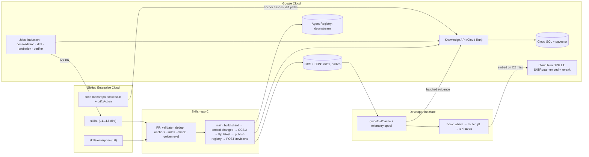

# Guidefold Knowledge Layer — Design v0.1

> **Proposed MVP revision (2026-09-05):** [MVP.md](MVP.md) and [ADR-0023](adr/ADR-0023-search-use-service-and-measured-utility.md) propose central SEARCH/USE, bounded local fallback and usage/usability measurement. Their scope and [event contract](SEARCH-USE-TELEMETRY.md) replace this document's older local-only serving, delayed telemetry, load-based probation and phase schedule for the proposed MVP. This is a plan amendment, not a claim that the service is implemented; sections explicitly describing shipped CLI behavior remain historical implementation notes.

**Status:** Draft v0.1 · 2026-09-04 · companion to `DESIGN.md` v0.3; supersedes its §7 (distribution), §10 (L0), §11, §13 and the ADRs listed in §10. Produced by a 4-architect / 3-judge synthesis; adversarial verification in §14 was done by hand after the automated refuters hit a session limit.
**Owner:** Platform / Developer Productivity
**One-liner:** Skills stay in the code monorepo next to the code they govern (dedicated repositories were rejected on 2026-09-04, see ADR-0018 and `docs/MVP.md` §2); nothing generated is committed; one Postgres behind a Knowledge API holds everything that is not skill text; GCS serves immutable index shards; knowledge climbs through a gated lifecycle with SkillPyramid-style induction; retrieval uses public skill-tuned models as-is.

> **Storage revision (2026-09-04, after review):** §1.1, §2 and §3 below describe the dedicated-repo variant that the judge panel ranked first. It is **not applicable at the design partner**. The binding storage decision is in `docs/MVP.md` §2 and ADR-0018: monorepo-native, path-filtered skill CI, bot on `proposal/*`, one Cloud SQL Postgres (+ pgvector, offline only), GCS artifacts, registry downstream. Sections 4–9 are also narrowed by the proposed 2026-09-05 MVP revision above; in retained historical sections, read "skills repo" as "the monorepo".

---

## 1. Summary and decision

1. **Leave the monorepo, keep git.** v0.3's conflicts came from two committed files (`.guidefold/index.lock`, `AGENTS.md` cards) that every skill merge rewrites. Skills move to `skills-enterprise` (L0) plus one `skills-<division>` repo per L1; the monorepo keeps one static stub.
2. **A database, but not for skill text.** Proposals, evidence, telemetry, provenance and rejection memory live in Cloud SQL Postgres (pgvector) behind a Knowledge API; git is the system of record for `SKILL.md`; Agent Registry stays downstream.
3. **SkillPyramid (2606.03692): adopt the mechanics, not the trust model.** Its layers, relation axes and grounded composition transfer; its missing validation is replaced by golden-set delta, owner acceptance and probation telemetry.
4. **Knowledge building is a state machine** `candidate → proposed → in_review → probationary → active → (lifted) → deprecated → archived` with gates G0–G7 (§5).
5. **Models: `pipizhao/SkillRouter-Embedding-0.6B` and `-Reranker-0.6B` (Apache-2.0) as-is, self-hosted on one L4;** fine-tune at ≥ 2k accepted pairs (§8).

## 2. Why not the code monorepo — and what still lives there

Assumptions: 2,000 engineers × 0.3–1.5 skill edits/month ÷ 21.5 workdays = **30–140 human PRs/day** (the upper bound is deliberately pessimistic: most engineers read skills, owners edit them); bots 20–50/day.

| Metric | v0.3 | This design |
|---|---|---|
| Skill PRs in the code merge queue | +50–190/day on ~1,000–2,500 code PRs/day, behind hour-scale builds (Uber SubmitQueue) | **0** |
| Generated-file churn | `index.lock` on 100 % of skill merges; root digest edits rewrite hundreds of cards | **none committed** |
| Same-file conflicts/day | **150–200**, ≥ 95 % synthetic | per division repo (k ≈ 38/day, N ≈ 400, T ≈ 1 d): (kT)²/2N × Zipf 2–3 ≈ 4–5 pairs → **1–3 textual/day/repo, 5–15 org-wide**, all genuine co-edits |

Piper runs ~40k commits/day with 60 % bots because bots touch disjoint files; the fix is removing fan-out files, not git.

**The monorepo keeps, committed once:** a root `AGENTS.md`/`CLAUDE.md`/`GEMINI.md` stub ("run `guidefold card` if no context was injected"); `.gitignore: .guidefold/`; a static `.github/instructions/guidefold.instructions.md` with `applyTo: "**"`; a comment-only drift Action that hashes anchored regions on each push to main and POSTs them to the Knowledge API, so no skills-repo job reads the PCI-scoped monorepo.

## 3. Storage model: what lives where

| Store | Holds | Writer | Never holds |
|---|---|---|---|
| **Skills repos** (git) | `SKILL.md`, `references/*`, `guidefold.yaml` subtree, vocabularies, generated CODEOWNERS, golden queries | humans via PR; `guidefold-bot` via PR on `proposal/*` only | cards, index, lock files, proposals |
| **Knowledge API + Cloud SQL** (Postgres, pgvector, 2–4 vCPU HA) | candidates, proposals, gate results, evidence, telemetry, anchors, rejection memory, provenance, audit | Knowledge API only | canonical skill text |
| **GCS + Cloud CDN** | `index/<shard>/<sha>/*` immutable; `index/<shard>/latest.json` (`must-revalidate`); `bodies/<urn>/<rev>.zip`; blobs | CI of the owning repo | anything hand-written |
| **Agent Registry** (v1alpha) | active revisions; one project per L1 division in its residency location | CI service account only | review state, history beyond 20 revisions |

## 4. Data model

ULID ids; logical URN of ADR-0008; every model-generated row carries `provenance {model, prompt_hash, input_urns[], shard_sha}`.

| Entity | Key fields |
|---|---|
| `skill_revision` (append-only) | urn, node, kind, **layer** (`atomic`/`task`/`abstract`), git_sha, body_hash, status, refines[], requires[{urn, when, provides}], lifted_from[{urn, sha, unit_hash}], stale_since |
| `candidate` (G0–G2) | source (`human`/`agent`/`induction`/`drift`), node, kind, draft_blob_sha, contributor, security_scan, novelty, episodes[], idempotency_key |
| `assignment` | skills[], relation (`SHARED_PART`/`SUBSET`/`MERGE`/`UPWARD`), target_node, target_kind, target_layer, rationale, abstract_pattern, group_hash |
| `proposal` | mode (`new`/`amend`/`merge`/`retire`/`lift`), target_urn, base_rev_sha, child_patches[], golden_delta, dup_check, verifier, state, pr_url, decision, reason |
| `evidence` | subject, type (`usage`/`coload`/`golden`/`negative_report`/`drift`/`owner_vote`/`verifier_pass`/`episode`), value, window |
| `anchor` | urn, origin_repo, path, symbol, region_sha256, resolved_at_commit; exported as `anchors.json` |
| `rejection_memory` | unit_hash, target_node, reason, expires_at (+90 d) |
| `telemetry` (90 d) | ts, principal_hash (monthly salt), node, harness, query_hash, shard_sha, injected[], loaded[], outcome_signal; rolled up into `skill_stats` |
| `audit_event` (append-only, hash-chained) | actor, action, entity, before/after hash, request_id; streamed to BigQuery for 7 years |
| `training_pair` (view) | (query, urn, label ∈ accepted/rejected/loaded_helped/loaded_wrong/sibling_negative) |

Frontmatter additions (scalar strings, ADR-0010): `layer` (defaults from kind: provider kinds → `atomic`, governance/`architecture`/`process`/`ai-sdlc` → `abstract`, else `task`); `requires: "urn:a | when: touching auth middleware | provides: authz pattern, urn:b"`; `status` gains `probationary`.

## 5. Knowledge lifecycle

**Sources:** owners via ordinary PRs; non-git authors (security, legal, product: about half the library) via a web form the bot turns into a PR; agents via `guidefold propose --from-session`; induction; evidence.

### 5.1 Gates

| Gate | Transition | Evidence required | Decider |
|---|---|---|---|
| **G0 Capture** | agent work → candidate | contributor approves the redacted diff (SAP); 6-category security scan; not derivable from code or an existing skill; governance kinds refuse agent origin | contributor + scanner |
| **G1 Structure** | candidate → proposed | `validate`: kind-per-level, layer-per-kind, trigger + negative trigger, digest, ≤ 500 lines, ZIP limits | linter |
| **G2 Novelty** | proposed | hybrid top-5 at same/adjacent level: cosine ≥ 0.85 **and** trigram Jaccard ≥ 0.4 → fail; > 0.70 → becomes `amend` of the nearest skill | checker; owner confirms merges |
| **G3 Verification** | proposed → pr_open | agent/induction origins only: for executable kinds an independent verifier model writes a check the skill must pass; ≥ 2 distinct-user episodes (the hook records one when another user's anchors match the candidate's trigger); non-executable kinds: owner pre-screen; every proposal: golden delta with no regression and ≥ 1 coverage gain | verifier job + eval |
| **G4 Ownership** | pr_open → merged | CODEOWNERS approve in GitHub (2 approvals incl. council for governance kinds and L0/L1; no self-approval); rejection reason → `rejection_memory`; bot PR body carries the gate summary | humans |
| **G5 Probation** | merged → active | agent-proposed and induced skills merge as `status: probationary`, served only inside the origin scope, ≤ 1 per injection; η = (pass+1)/(trial+2) ≥ 0.6 after ≥ 3 real loads, no `report --wrong`; 30-day cap; owner edits skip G5 | probation scorer |
| **G6 Lift** | active(L) → proposed(LCA) | §5.2 | induction → G4 at target |
| **G7 Retire** | active → deprecated → archived | η ≤ 0.2; or 0 loads in 90 d (`task`/`atomic`) / 180 d (`abstract`/governance); or anchors failing 14 d unacknowledged (7 d for `policy`); or `program.until` passed. Deprecated = flagged 30 d, then archived by bot PR | consolidation → owner |

Human-authored skills enter at G1 through a normal PR, pass G2 in CI, and G4 is their only human gate.

### 5.2 Upward abstract induction (SkillPyramid adapted)

Trigger: merge of a skill at level ≥ L2, or nightly delta (query-skill mode, Eq. 9); a full pass only at bootstrap.

1. **Coarse grouping (no model):** siblings/cousins with card cosine ≥ 0.85, same or adjacent level, same kind family, plus `similar` edges; skip unchanged or single-team groups.
2. **Screen (model, cached by group hash):** SCREEN prompt over names, descriptions, digests; require ≥ 3 selected skills from ≥ 2 owner teams (cross-team recurrence is the only evidence of generality).
3. **Fine analysis (model, ≤ 5 tool rounds, full bodies):** DECIDE prompt → `assignment`; target = lowest common ancestor; UPWARD yields `abstract` skills, SHARED_PART/SUBSET `atomic` ones.
4. **Target check (no model):** kind allowed at target level (DESIGN §5.1b); an existing parent covering the pattern → `amend`; unit hashes rejected there < 90 d → skip.
5. **Build (model):** "higher-level guidance, not an action script"; ≤ 5 lifted units; `lifted_from: urn@sha`; child patches replace lifted text with a `refines` link; scratch generation is forbidden (SkillPyramid Table 2: scratch 64.3 < flat 75.7).
6. **Gates G1–G3** on the draft; ≤ 3 open bot PRs and ≤ 5 proposals per target node per week.
7. **Propose:** bot PR in the target repo with child patches; cross-repo child PRs open after the parent merges.
8. **Accept/reject (G4), probation and monitor (G5, G7):** accept → `probationary` with `refines` edges, η ≥ 0.6 → active, unused after 90 days → retirement proposal; reject → rejection memory.

**What replaces environment reward r:** golden-set delta (step 6), owner acceptance and probation η (step 8); nothing induced becomes `active` without all three. Not adopted: automatic fold-back, trajectory-mined skills, a flat library.

### 5.3 Consolidation and metrics

Nightly per level: `similar` clusters → merge proposals; child-vs-parent contradictions → conflict comments; anchor failures → drift proposals; expired programs → retirement. All pass G4; none auto-merge.

Metrics per level × kind × layer: acceptance per gate (≥ 30 % at G4 for lifts; induction halts under 10 %); zero-load share (< 15 %); near-duplicate pairs per 1,000 skills (0); anchor failure rate; unsafe-accept rate (0); skills injected per prompt (cap 4).

## 6. Write model and concurrency

| Writer | Writes | Never |
|---|---|---|
| Engineers | `SKILL.md` on their branches; PR review; `guidefold propose` | generated files; skills in the monorepo |
| `guidefold-bot` (GitHub App) | `proposal/<id>` branches and PRs from gate-passed proposals; child patches; archive moves | merge; push to a human branch (ruleset restricts `proposal/*` to the app) |
| Skills-repo CI | its GCS shard + `latest.json`; registry revisions | git |
| Code-monorepo CI | anchor hashes and diff paths to the Knowledge API; an advisory PR comment | blocking checks; files |
| Knowledge API | all DB rows; idempotency keys; transactional outbox for side effects | git, registry |

`guidefold propose` and PR CI pre-flight `base_rev_sha` against `skill_revision` and open proposals on the same URN, showing the colliding PR at propose time. Bot PRs rebase at unit level when unit sets are disjoint; same-unit collisions return to the author; a human edit always wins over a bot PR. Per-repo merge queue (group 5) clears 30–50 PRs/day/repo in minutes (Shopify runs ~400/day on one queue). Bot budget: 50 PRs/day × ~5 content-creating calls, paced ≤ 20/min against GitHub's 80/min limit. Registry: revisions trimmed to 20; quota increases filed day 1. `propose --offline` spools to `.guidefold/outbox/`; a ruleset bypass for platform engineering is ingested as `break_glass: true`.

## 7. Serving

The router (DESIGN §8) and caches (§9) keep their algorithm; sources change:

| Stage | Change |
|---|---|
| 0 `where(cwd)` | `git remote` + relative path → node via `nodes.json` in the shard |
| C1 refresh | SessionStart `prewarm` fetches `latest.json` for `global` and the division (~50–100 ms, 10-min TTL), downloads only changed shards, pins the sha per session; merge → hooks ≤ 10 min |
| 2 governance filter | `probationary` only inside its origin scope, ≤ 1 per injection; `deprecated` flagged; `archived` never |
| 3 dense leg | query embedding from `POST /embed` (100–300 ms) or a **local daemon** (`guidefold serve`, ONNX int8, model resident; the hook itself is a short-lived process and cannot afford a 1–3 s model load per prompt); skipped at 1.5 s, BM25 + graph must pass the golden floor |
| 6 rerank | `find`: `POST /rerank` top-20, sub-second; `find --deep`: one Gemini Flash-Lite listwise call (~$0.005); hook only on C2 hit |
| 7b closure | a `requires` child is added only when its `when` matches the query anchors |
| L0 card | `guidefold card` renders the node card (≤ 6 KB) at SessionStart on all four harnesses; where a harness has no working SessionStart injection (Copilot issues #991/#2201), L0 degrades to the static `applyTo: "**"` instructions file plus the L1 hook — accepted, since nothing generated may be committed |
| `load` | C3 → GCS `bodies/` → registry REST last; no `gcloud` on any hot path |

Latency: warm hook p50 ≤ 300 ms, p95 ≤ 2 s, watchdog at 3 s (DESIGN G3); cold shard download ≈ 0.5–1.5 s once per sha; `find` ≤ 1 s; `find --deep` 1–3 s. Offline: cached shards plus a `git clone` of the skills repos are the full truth.

## 8. Models

| Use | Now | Switch when |
|---|---|---|
| Index embedding (CI, changed skills) | one of two Apache-2.0 Qwen3-Embedding-0.6B fine-tunes, chosen by a Phase-1 bake-off on our golden set: `pipizhao/SkillRouter-Embedding-0.6B` (73.54 nDCG@10 on SkillRet, cross-pool) or `ThakiCloud/SKILLRET-Embedding-0.6B` (81.12 in-domain, 8,192-token context); 1024-d int8; full rebuild 5–15 min, < $0.20 | fine-tune (SkillRet recipe, sibling-scope negatives from `training_pair`) at ≥ 2k accepted pairs or golden nDCG@10 < 0.75; < $5 |
| Query embedding (hook) | same model on Cloud Run GPU L4; laptop ONNX int8 fallback | Vertex embedding only if p95 > 500 ms persists, forfeiting the skill-tuned index |
| Rerank top-20 | `pipizhao/SkillRouter-Reranker-0.6B` (Qwen3-Reranker-0.6B base, Apache-2.0, pointwise yes/no logit; the only released skill reranker, R3-Skill weights are not public), same L4 | listwise fine-tune (ListNet with graded labels from `training_pair`) at ≥ 5k labelled lists; Vertex Ranking API only if bodies fit its 512–1,024-token record cap, which they mostly do not |

Decision rule: a skill-tuned 0.6B embedder beats its base by 12–19 nDCG@10 on public skill benchmarks (SkillRouter-Emb 73.54, SKILLRET-Emb 81.12, base 61.94) and MTEB rank predicts skill retrieval only at ρ = 0.70, so a generic API embedder is the worse bet; expect 8–15 points still on the table until we fine-tune on our own vocabulary. Index and query embeddings must come from the same model, which is why the query endpoint is self-hosted. `ThakiCloud/SKILLRET` is the external regression set; R3-Skill weights are not public.

**For a non-technical reader.** An embedding model turns any text, a request or a skill, into a long list of numbers so that texts about the same thing land close together, like cities in one region of a map. When a developer types a request, we place it on that map and pick the nearest few dozen skills out of thousands in a fraction of a second; that shortlist is fast but rough, because each skill was reduced to one point before anyone saw the question. A reranker is a second, slower judge that reads the request and each shortlisted skill side by side and scores the fit; it is more accurate but affordable only for about twenty candidates. SkillRouter's authors trained both models on skill files and released them under a licence we can use, which is why they beat general-purpose text models at this job. They have never seen our world: product names, team structure, and the rule that a team's skill sits on top of the company skill it refines. So the models only say "these look relevant"; Guidefold's graph of ownership and dependencies says "and these are the ones you are expected to use here, in this order". Every accepted or rejected proposal becomes a training note; after a couple of thousand notes we re-teach the models our vocabulary in minutes on one GPU.

## 9. Governance, security, audit, compliance

- **Ownership:** CODEOWNERS per node directory, generated from `guidefold.yaml`; `_root` families owned by councils (DESIGN Q2); nightly check that node owner = CODEOWNERS team of its `code_paths` in the monorepo.
- **Review:** GitHub PR review is the only approval mechanism for skill text. The Knowledge API refuses approve/reject/vouch calls carrying `origin=agent_session`; the bot never merges; humans never push `proposal/*`; everyone but CI is `agentregistry.viewer`.
- **Audit:** `audit_event` and the GitHub Enterprise audit log streamed to BigQuery for 7 years (PCI DSS 10.7); each registry revision carries `revision_of_proposal: "<id>"`.
- **Privacy correction (2026-09-05):** salt rotation is not erasure and hashes are not anonymous data. The proposed [SEARCH/USE event contract](SEARCH-USE-TELEMETRY.md) requires transient prompt processing without default content logging, tenant-scoped keyed pseudonyms, and actual deletion/expiry of linked events and derived data. Evaluation/training samples are separately redacted and opt-in; a query hash cannot reconstruct a training example. `Proprietary` skill content remains excluded from unauthorized external export.
- **Residency:** default one registry project, bucket and shard per L1 division in its region (`eu`/`us`); `global` only where legal signs off, given the known cross-region leak in `global` search (ASSESSMENT R11). Per-division projects also multiply the 100-skill default quota.
- **Budgets:** ≤ 5 lifted units per proposal, ≤ 3 open bot PRs per node, 14-day bot PR expiry; GCS reads require the developer's ADC identity (ADR-0007).

## 10. Migration from DESIGN.md v0.3

DESIGN.md: §2 G1 and §4 P1 read "in skills repos, bound to code by anchors"; §6 takes the diagram of §3; §7 shards are built by each skills repo's CI with SkillRouter 1024-d int8 vectors plus `nodes.json`, `anchors.json`, `bodies/`, and `.guidefold/index.lock` becomes `latest.json`; §9 C1 is keyed by `latest.json` sha with checksum-only downloads and no `gcloud`; §10 L0 becomes static stub + SessionStart `guidefold card`; §11 is replaced by §5; §13 PR CI becomes validate → dedup → anchors → `index --check` → eval → induction preview, main becomes shard → embed → GCS → `latest` → publish → `POST /revisions`, `materialize` is deleted; §14/§17 gain Knowledge API, self-hosted models and R9–R14. CONVENTIONS §2/§4/§9: location `<node dirs>/<skill>/`, anchors `<repo>:<path>#<symbol>`, no generated file committed.

New ADRs: **ADR-0011** dedicated skills repos per L1, CODEOWNERS generated from `guidefold.yaml` (supersedes ADR-0005); **ADR-0012** no generated file is committed; L0 cards are SessionStart-delivered (amends ADR-0006); **ADR-0013** Knowledge API + Cloud SQL holds proposals and evidence, git keeps skill text, one bot writer on `proposal/*` (amends ADR-0001); **ADR-0014** drift via anchors hashed by the code repo's own CI, comment-only; **ADR-0015** SkillRouter models self-hosted from Phase 1 (amends ADR-0009); **ADR-0016** gates G0–G7 and SkillPyramid layers; **ADR-0017** owner review precedes any serving. ADR-0002/0003/0004/0007/0008/0010 stand.

Rejected: DB or registry as system of record for skill text (rebuilds GitHub review, or trusts a v1alpha API); routing human edits through the bot (blocks suggested changes); event sourcing (unneeded at 190 writes/day); an LLM verifier on human edits (unmeasured); registry `draft` for probation (visibility unverified); a single skills repo (no residency partition); a pre-review probation overlay; CI-pushed `anchors.lock`.

## 11. Phasing

| Phase | Weeks | Delivers |
|---|---|---|
| **1 — split and serve** | 4 | skills repos via `git filter-repo` per division; CODEOWNERS generation; merge queues; per-shard CI + `latest.json`; static stubs, drift Action; CLI 0.4 (`where`, `card`, checksum `prewarm`, REST `load`); SkillRouter endpoint; laptop ONNX measurement; golden set reproduces v0.3 numbers |
| **1.5 — knowledge API** | +3 | schema, API, audit chain, anchors, `propose` and `--offline`, G0–G2, non-git web form, bot PRs, propose-time conflict check |
| **2 — lifecycle** | +4 | verifier (G3), probation scorer (G5), telemetry sync, induction and consolidation comment-only for two weeks, then lift PRs on two pilot nodes; retirement proposals; dashboards |
| **3 — learn** | later | fine-tuning at ≥ 2k pairs; quarterly rebuild-from-git rehearsal; Backstage export; ARD façade |

Two engineers for Phases 1–2 (~11 weeks), then 0.5 FTE. Run cost ≈ $700–1,300/month with the endpoint scheduled 10 h/day; a 24/7 endpoint for teams in the US, Poland and India is closer to $500 per replica, so budget $1,100–1,700/month with HA. Verifier runs ($150–250) are the other large item. All figures are estimates to be replaced by Phase-1 measurements.

## 12. Risks and open questions

| ID | Risk / question | Mitigation |
|---|---|---|
| R9 | Induced parents are self-generated content (SkillsBench −8 to −11.5 pp); SkillPyramid validated only end reward | grounded composition, golden delta, owner acceptance, probation η; induction halts below 10 % acceptance |
| R10 | Parent-level duplication (17–63 % loss; SkillPyramid Fig. 3) | G2 hard fail at 0.85, amend at 0.70, nightly consolidation |
| R11 | Reviewer fatigue; "general" means "true for two teams" | ≥ 2 owner teams, ≤ 5 units, node budgets, rejection memory |
| R13 | Model endpoint down or laptop ONNX too slow | BM25 + graph floor at 1.5 s; two replicas if p95 > 500 ms |
| R14 | Cross-repo lift leaves duplicated text until the child PR merges | child PR opens automatically; dedup whitelists `lifted_from` pairs |
| Q5 | Is an LLM-written check a meaningful gate for Markdown guidance outside SkillsBench's setting? | compare verifier verdicts with later η on pilot nodes before extending G3 |
| Q6 | Can corporate laptops run the 0.6B ONNX model within 400 ms warm? | Phase 1 measurement; else endpoint-only |

## 13. Evidence and prior art used

- Storage and throughput: Google Piper (CACM 2016), Microsoft Windows (Harry 2017), Uber SubmitQueue, Shopify merge queue, Brindescu 2019, Yuzuki, GitHub merge-queue and rate-limit docs, GCS caching docs.
- Lifecycle: SkillPyramid 2606.03692, SkillsBench 2602.12670, CoEvoSkills 2604.01687, MSCE 2607.16621, SAP Shared Organizational Memory 2608.00122, XSkill 2603.12056, Memento-Skills 2603.18743, GitHub Copilot memory blog, near-duplicate degradation 2601.04748.
- Retrieval and models: Graph-of-Skills 2604.05333, SkillRouter 2603.22455 and its HF model cards, SkillRet 2605.05726 and `ThakiCloud/SKILLRET`, R3-Skill 2606.03565.
- Platform facts: `docs/ASSESSMENT.md`, ADR-0001…0010, `docs/CONVENTIONS.md`.

## Key claims this design depends on

| # | Claim (falsifiable) | Section |
|---|---|---|
| K1 | A division skills repo at 30–50 PRs/day with no committed generated files sees fewer than 25 textual same-file conflicts per week, all genuine co-edits; v0.3's layout sees more than 100, ≥ 95 % synthetic | §2, §6 |
| K2 | Removing skill PRs from the code monorepo frees 1–15 % of its merge-queue slots (depends on edit rate); skill PR-to-merge time drops below 30 min p50 because skill CI is minutes, not hours | §2, §6 |
| K3 | Induced parents passing golden delta, owner acceptance and η ≥ 0.6 do not regress golden Hit@1/Recall@8 and reach ≥ 30 % G4 acceptance within 3 months on pilot nodes | §5 |
| K4 | Holding near-duplicate pairs at 0 per 1,000 skills keeps golden Hit@1 within 2 points of baseline as the library grows from 2k to 10k | §5.1, §5.3 |
| K5 | The better of SkillRouter-Emb / SKILLRET-Emb as-is beats base Qwen3 and a Vertex embedding by ≥ 5 nDCG@10 on our golden set; fine-tuning on ≥ 2k pairs adds ≥ 5 more | §8 |
| K6 | A warm hook stays at p50 ≤ 300 ms with the 10-min `latest.json` refresh; a merged skill reaches hooks in ≤ 10 min p95 | §7 |
| K7 | Agent-proposed candidates gated by G0–G3 reach ≥ 50 % productive rate with 0 unsafe accepts and ≤ 1 % over-block | §5.1 |
| K8 | After two quarters of G7 proposals, zero-load skills are < 15 % of the active set; without G7 the share exceeds 40 % | §5.1, §5.3 |

## 14. Verification log (manual review, 2026-09-04)

The automated refuters (3 per claim) did not run; the review below was done by hand against the four research digests, `docs/ASSESSMENT.md` and the model cards.

| Claim | Verdict | What changed |
|---|---|---|
| K1 conflicts | **survived, weakened** | The doc's own estimate (1–3 textual conflicts/day/repo) is 7–21/week, so "< 15" was at the edge; threshold set to < 25/week and made a Phase-1 measurement. The load-bearing part is that ≥ 95 % of v0.3's conflicts are synthetic (lock file, cards) and disappear by construction. |
| K2 queue slots | **weakened** | 1.5 skill edits/engineer/month is an upper bound; at 0.3 the freed share is ~1 %. The benefit that stands is decoupling skill review from hour-scale code CI, not throughput. |
| K3 induced parents | **unproven, kept as gate** | SkillPyramid never validated induced skills against anything but end reward, and SkillsBench found self-generated skills score below none. The design already treats this as a hypothesis with a kill-switch (induction halts below 10 % acceptance); the 30 % target is a pilot metric, not a claim. |
| K4 dedup keeps Hit@1 | **weakened** | Direction supported (near-duplicates cost 17–63 %); "within 2 points 2k → 10k" is unmeasured. Kept as the golden-set target. |
| K5 embedder | **survived, amended** | Both models verified on Hugging Face under Apache-2.0. SKILLRET-Embedding-0.6B scores higher on the public benchmark than SkillRouter-Emb; §8 now prescribes a bake-off instead of a fixed pick. The Vertex comparison is unmeasured. |
| K6 hook latency | **survived, amended** | 300 ms warm p50 holds only with C2 hits or the endpoint; a laptop model needs a resident daemon (`guidefold serve`), added to §7. The 10-min propagation follows from `latest.json` TTL. |
| K7 agent proposals | **unproven** | Targets borrowed from SAP's deployment; no evidence for our population. Kept as pilot metrics. |
| K8 retirement | **direction supported, numbers unproven** | SkillPyramid Fig. 3 (append-only degrades) supports G7; 15 % / 40 % are targets. |
| Reranker availability | **verified** | `pipizhao/SkillRouter-Reranker-0.6B` exists (Qwen3-Reranker-0.6B base, Apache-2.0, pointwise). R3-Skill weights are not public. |
| Endpoint cost | **corrected** | $150–250/month assumed 10 h/day; a 24/7 replica is ~$500. §11 updated. |
| Residency "never global" | **softened** | Skill text rarely carries personal data; per-division regions are the default, `global` allowed with sign-off. |
| L0 without hooks | **gap documented** | Copilot from repo root with no SessionStart injection gets only the static instructions file; accepted trade-off of "nothing generated is committed". |
