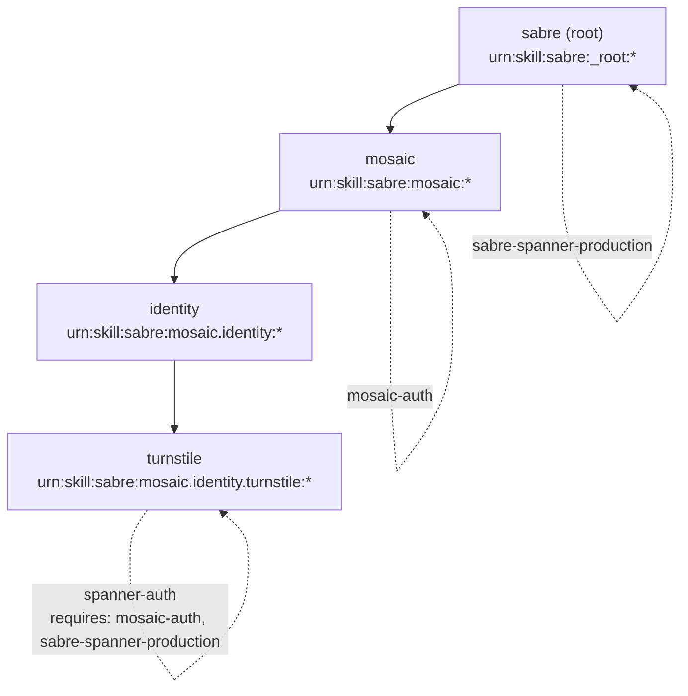
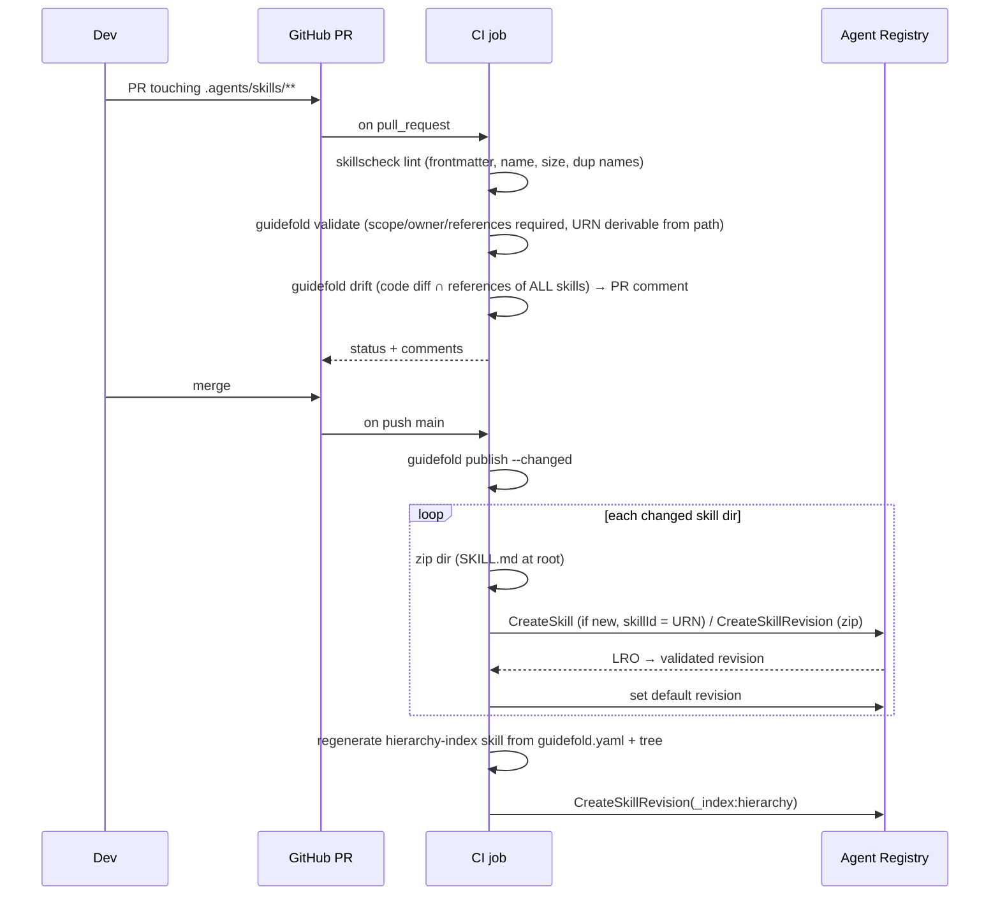
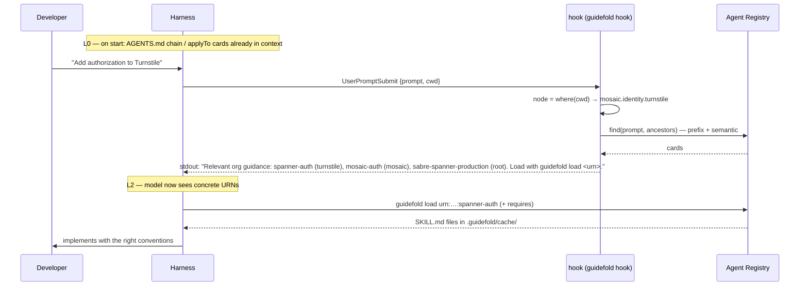

# Guidefold — Design Doc (MVP)

**Status:** Draft v0.2 · 2026-09-04 (v0.2: deterministic context delivery — scope cards + hooks)
**Owner:** Platform / Developer Productivity
**One-liner:** Git-native skill CI for the the design partner monorepo, with Google Agent Registry as the distribution layer and one bootstrap skill that lets any local harness (Copilot CLI, Claude Code, Codex, Gemini CLI) discover organization-specific guidance progressively, scoped to where it is in the monorepo.

---

## 1. Problem

- The monorepo has (or will have) hundreds of SKILL.md files across `sabre / product / platform / team` levels.
- Every harness loads skills differently; nested skill trees bloat context or get ignored.
- Nobody knows which skill governs which code path, who owns it, and whether it is still true after a code change.
- Gemini Enterprise + Agent Registry are being rolled out; we should not build a registry, search, or portal ourselves.

## 2. Goals (MVP)

| # | Goal | Success signal |
|---|------|----------------|
| G1 | Skills live in the monorepo next to the code they govern, with `scope`, `owner`, `references` | 100% of published skills pass CI |
| G2 | Every merged skill is published as an immutable `SkillRevision` in Agent Registry with the monorepo hierarchy encoded in its URN | `gcloud … skills search --query="skillId:urn:skill:sabre:mosaic.*"` returns the subtree |
| G3 | A local harness in any monorepo directory can run `find → load` and get the right skill in ≤ 2 tool calls | Demo passes in Copilot CLI, Claude Code, Codex, Gemini CLI |
| G4 | A code PR that touches files a skill references gets a "possibly stale" comment | Zero-ML drift check live |

## 3. Non-goals (MVP)

- No own registry, DB, vector store, search, portal, RBAC.
- No skill evaluation harness in CI (Phase 2 — reuse `agent-skill-eval` / `caliper`).
- No LLM-based commonality/conflict detection (Phase 1.5 — single Gemini call in PR).
- No trajectory → skill PR (Phase 3).
- No custom MCP server (only if Agent Registry MCP lacks skill tools after verification — see Open Questions).

## 4. Principles

1. **Git is the source of truth. Registry is a build artifact.** Nothing is edited in the registry by hand.
2. **Registry stores, we curate.** Storage, versions, search, IAM, audit = Google. Hierarchy, ownership, drift, quality = Guidefold.
3. **Deterministic first, model-decided last.** The hierarchy digest reaches the agent through files and hooks the harness loads by path (no model decision); the model only decides *which* already-listed skill to load.
4. **One script, four harnesses.** The bootstrap skill drives a tiny CLI (`guidefold`) so we don't maintain per-harness MCP configs in MVP.
5. **KISS now, hooks for later.** Every Phase 2/3 feature plugs into the same PR pipeline; nothing in MVP has to be rewritten.

## 5. Architecture

### 5.1 Context

```mermaid
flowchart LR
  subgraph Monorepo["the design partner monorepo (GitHub)"]
    T[".agents/skills/** (nested by hierarchy)"]
    Y["guidefold.yaml (hierarchy map)"]
  end

  subgraph CI["CI (GitHub Actions / Cloud Build)"]
    L["lint (skillscheck)"]
    D["drift check (diff ∩ references)"]
    P["publish (zip → CreateSkillRevision)"]
    I["hierarchy-index skill (generated)"]
  end

  subgraph GCP["Google Cloud"]
    R[("Agent Registry\nSkill / SkillRevision / Publisher")]
    G["Gemini Enterprise / ADK agents\n(list_skills / load_skill)"]
    V["Vertex / Model Garden\n(Gemini for Phase 1.5 checks)"]
  end

  subgraph Harness["Local harnesses"]
    H1["Copilot CLI"]
    H2["Claude Code"]
    H3["Codex"]
    H4["Gemini CLI"]
    B["bootstrap skill: guidefold\n(find → load)"]
  end

  T --> L --> D --> P --> R
  Y --> I --> P
  R --> G
  H1 & H2 & H3 & H4 --> B
  B -- "gcloud alpha agent-registry skills search\n(semantic + URN prefix)" --> R
  D -. Phase 1.5 .-> V
```

### 5.2 Hierarchy: how the monorepo tree is encoded in the registry

The registry has no "folder" concept. We encode the tree in three places that the registry already indexes:

| Where | Convention | Why |
|-------|-----------|-----|
| `skillId` URN | `urn:skill:sabre:<dotted.hierarchy.path>:<skill-name>` e.g. `urn:skill:sabre:mosaic.identity.turnstile:spanner-auth` | `skillId` is prefix-searchable → subtree queries (`skillId:urn:skill:sabre:mosaic.identity.*`) |
| `description` frontmatter | starts with `[mosaic/identity/turnstile]` | `frontmatter.description` and `description` are keyword-indexed |
| `metadata` frontmatter | `scope`, `owner`, `parent`, `requires`, `references`, `paths` | Semantic search indexes the whole SKILL.md; harness reads it after load |

Plus one **generated** skill, `urn:skill:sabre:_index:hierarchy`, whose SKILL.md is the whole tree (node → owner → child skills). The bootstrap skill loads it once per session as the map.



Discovery walks **up** the tree: a task in `platforms/mosaic/identity/turnstile/` searches `turnstile → identity → mosaic → _root` (plus semantic hits anywhere, ranked lower).

### 5.3 Publish pipeline (on merge to main)



### 5.4 Context delivery model — three layers, general → specific

The MVP v0.1 draft relied on the model *choosing* to activate the bootstrap skill. That is not deterministic. v0.2 splits delivery into layers ordered by how much we trust the mechanism:

| Layer | Mechanism | Who decides | Content | Cost |
|-------|-----------|-------------|---------|------|
| **L0 Scope cards** (always on) | Generated `AGENTS.md` in every node directory + generated `.github/instructions/<node>.instructions.md` with `applyTo` + nested `CLAUDE.md` | the harness, by cwd/file path — no model decision | what this node is, owner, one-paragraph digest of each ancestor (the design partner → product → platform → team), list of skill URNs at this level and above, "how to get more" | ~30–60 lines per level, loaded as a chain |
| **L1 Prompt-time find** (automatic where hooks can inject) | `UserPromptSubmit`/`SessionStart` hook runs `guidefold find "<prompt>" --scope <node>` and injects top-3 cards | deterministic, per prompt | skill cards (URN + description) | 1 registry call (~1 s), cached per prompt hash |
| **L2 Load on demand** | bootstrap skill / agent runs `guidefold load <urn>` | the model, but only after it already sees the cards | full SKILL.md + `requires` chain | 0–3 loads per task |

The user's goal — "agents draw from skills from general to specific, and sometimes pull root-level context like *what the design partner is / what the monorepo is*" — is satisfied by L0 for the cheap digest and by L1/L2 for the heavy root skills (`sabre-spanner-production`, `monorepo-conventions`) which surface via ancestor-prefix ranking and semantic search.

Per harness:

| Harness | L0 | L1 | L2 |
|---------|----|----|----|
| Copilot CLI / IDE | AGENTS.md chain (cwd→root, plus nested on touched files) **and** `applyTo` instructions — works when launched from root *or* from the node dir | not available (config-file `userPromptSubmitted` output is dropped) → L0 card tells the agent to run `guidefold find`; `sessionStart` hook pre-warms cache | bootstrap skill in `.github/skills` |
| Claude Code (Vertex) | root `CLAUDE.md` = `@AGENTS.md`; nested `CLAUDE.md` loaded lazily when Claude reads files in that dir | `UserPromptSubmit` hook stdout → context | bootstrap skill in `.claude/skills` |
| Codex | `AGENTS.md` chain merged root→cwd; nested `.agents/skills` native | `UserPromptSubmit` hook (verify injection) | native + skill |
| Gemini CLI / ADK agents | `GEMINI.md` = `@AGENTS.md`; `.agents/skills` alias | hooks (verify) / ADK `list_skills`/`load_skill` from registry | native |

#### 5.5 Discovery at runtime (Claude Code shown; Copilot differs only in L1)



### 5.6 Monorepo layout (v0.2 — generated files marked ⚙)

```
monorepo/
├── guidefold.yaml                       # hierarchy map (hand-written)
├── AGENTS.md                         ⚙  # root scope card: what the design partner is, what the monorepo is, root skill URNs
├── CLAUDE.md                         ⚙  # "@AGENTS.md"
├── GEMINI.md                         ⚙  # "@AGENTS.md"
├── .github/
│   ├── instructions/
│   │   ├── mosaic.instructions.md    ⚙  # applyTo: "platforms/mosaic/**"  → same content as node AGENTS.md
│   │   └── mosaic.identity.turnstile.instructions.md ⚙
│   ├── hooks/guidefold.json          ⚙  # sessionStart: pre-warm cache
│   └── skills/guidefold -> ../../.agents/skills/guidefold
├── .claude/
│   ├── settings.json                 ⚙  # UserPromptSubmit + SessionStart → guidefold hook
│   └── skills/guidefold -> ../../.agents/skills/guidefold
├── .agents/skills/                      # ROOT skills (hand-written)
│   ├── guidefold/                       # bootstrap skill + scripts/guidefold
│   ├── sabre-spanner-production/
│   └── monorepo-conventions/
├── platforms/mosaic/
│   ├── AGENTS.md                     ⚙  # scope card: mosaic + inherited digest of root
│   ├── CLAUDE.md                     ⚙  # "@AGENTS.md"
│   ├── .agents/skills/mosaic-auth/
│   └── identity/turnstile/
│       ├── AGENTS.md                 ⚙  # scope card: turnstile + digests of identity, mosaic, root
│       ├── CLAUDE.md                 ⚙
│       └── .agents/skills/spanner-auth/SKILL.md
└── .guidefold/cache/                    # gitignored
```

`guidefold materialize` regenerates every ⚙ file from `guidefold.yaml` + the skill tree; CI fails if a PR leaves them stale (`materialize --check`). Digests come from each skill's `description` and an optional `metadata.digest` (2–3 sentences) — no LLM in MVP.

**Launch directory:** with L0 materialized, Copilot CLI works from the repo root (nested cards load when it touches files; `applyTo` cards load on matching paths) and from the node directory (chain loads at start). Launching in the node directory is still the fastest start for Copilot and is the documented behaviour, not a workaround; the generated `AGENTS.md` there carries the root context, so nothing is lost.

## 6. Components

| Component | What it is | Size (MVP) |
|-----------|-----------|-----------|
| `guidefold.yaml` | hierarchy map (see CONVENTIONS.md) | 1 file |
| `guidefold` CLI | Python script inside the bootstrap skill: `where`, `find`, `load`, `hook`, `materialize`, `validate`, `drift`, `publish`, `index` | ~450 LOC |
| scope cards (L0) | generated `AGENTS.md` per node, `.github/instructions/*.instructions.md`, nested `CLAUDE.md`/`GEMINI.md` | generated |
| hook configs | `.claude/settings.json`, `.github/hooks/guidefold.json`, `~/.codex/hooks.json` template | 3 small JSON files |
| bootstrap skill | `SKILL.md` telling the agent when/how to use the CLI | 1 file |
| CI workflow | lint → validate → materialize --check → drift on PR; publish → index → materialize on main | 2 workflow files |
| hierarchy-index skill | generated SKILL.md with the tree | generated |

`find` and `load` are wrappers over `gcloud alpha agent-registry skills search` and the revision download REST call; auth = the developer's existing `gcloud auth application-default login`. No tokens to manage in MVP.

## 7. Harness integration

### 7.1 Copilot — options (revised)

| Option | When | How |
|--------|------|-----|
| **A. Materialized L0 + bootstrap skill (MVP)** | now | Generated `AGENTS.md` chain + `.github/instructions/*.instructions.md` (`applyTo` per node) + `.github/skills/guidefold`. `sessionStart` hook (`.github/hooks/guidefold.json`) pre-warms `.guidefold/cache` for the current node's chain so `load` is instant. Discovery calls use the developer's gcloud identity. |
| **B. Agent Finder + private ARD registry (Phase 2)** | when we want native `/af` | ~200-LOC Cloud Run "ARD façade": `GET /.well-known/ai-catalog.json` + `POST /search` → Agent Registry skill search; point Agent Finder at it via enterprise managed settings. Gives Copilot an L1-equivalent. |
| **C. Agent Registry MCP in Copilot** | if/when MCP exposes skill tools | `https://agentregistry.googleapis.com/mcp` as HTTP MCP with OAuth; `roles/mcp.toolUser` + `agentregistry.viewer`. |

Copilot cloud agent (PR-based) reads AGENTS.md/instructions from the default branch, so L0 works there too; hooks and private MCP registries do not apply to cloud agent.

### 7.2 Claude Code on Vertex AI (Model Garden) — target harness

Claude Code supports Vertex AI natively: `CLAUDE_CODE_USE_VERTEX=1`, `CLOUD_ML_REGION`, `ANTHROPIC_VERTEX_PROJECT_ID`, auth via Application Default Credentials. Consequence: **one identity (gcloud ADC) for the model, the registry search and the payload download**, no extra tokens. Enterprise managed settings can push the hook config and the bootstrap skill to every machine. L1 works fully (hook stdout → context). When the registry MCP gains skill tools, Claude Code's remote-MCP OAuth makes option C a config change.

Recommended migration order: Copilot (A) now → Claude Code on Vertex with hooks as the reference implementation → Gemini/ADK agents consume the same registry natively.

## 8. Phasing

| Phase | Weeks | Delivers |
|-------|-------|----------|
| **0 — Demo** | 1 | 6–8 skills in a 3-level tree, `guidefold.yaml`, `materialize` (L0), manual `publish`, Claude Code hook (L1) + Copilot from root and from node dir |
| **1 — MVP** | 2–3 | CI lint/validate/drift/publish/materialize --check, hierarchy-index, Codex + Gemini CLI, Claude Code on Vertex config, 2 real teams onboarded |
| **1.5** | +1 | One Gemini (Vertex) call in skill PRs: "which paragraphs belong to a parent scope / contradict parent skill?" |
| **2** | +3 | ARD façade for Agent Finder; skill eval on affected skills (`agent-skill-eval`) |
| **3** | later | trajectory → skill PR; usage/outcome metrics |

## 9. Risks & open questions

| ID | Question / risk | Mitigation |
|----|-----------------|-----------|
| Q1 | Skill search is **Preview**; API surface may change | Wrap all registry calls in one module; pin `gcloud` version |
| Q2 | Agent Registry MCP server may not expose `search_skills`/`get_skill` (not in docs) | MVP doesn't depend on MCP; verify with `tools/list` (no auth needed) on day 1 |
| Q3 | Nested `.agents/skills` support differs per harness (Claude Code, Copilot) | Root bootstrap skill covers all; ambient nesting is a bonus where supported |
| Q4 | Payload validation limits (zip size/content) | Keep skills small; move large refs to `references/` files; CI checks size |
| Q5 | Region: skills Preview region availability vs. the design partner's registry region | Confirm during setup; `global` if available |
| Q6 | IP/licensing for OSS release while built at the design partner | Legal sign-off before publishing repo |
| Q7 | Drift false positives | Only *declared* `references` in MVP; no inference |
| Q8 | L0 chain grows with depth (4 levels × 60 lines) | Cap card size in CI; digests only, no procedures in cards |
| Q9 | Copilot CLI from root ignores nested AGENTS.md until a file is touched (copilot-cli #3051) | `applyTo` instructions + root card instruction "run `guidefold where`"; launching at node dir remains supported |
| Q10 | Codex/Gemini hook context injection semantics | Verify on day 1; fallback = L0 + skill |

## 10. Demo script (Phase 0)

1. `cd platforms/mosaic/identity/turnstile && codex` (or `claude`, `copilot`, `gemini`).
2. Prompt: *"Add a new authorization check for the Turnstile Spanner path."*
3. L0: the generated `AGENTS.md` chain (root → mosaic → identity → turnstile) is already in context. In Claude Code the hook injects the top-3 cards; in Copilot the turnstile card says which URNs exist and the agent runs `guidefold find`.
4. `guidefold find` returns `spanner-auth` (turnstile), `mosaic-auth` (mosaic), `sabre-spanner-production` (root).
5. `guidefold load` × 3; agent implements with the right conventions.
6. Open a PR renaming `legacyAuthMode` → `authorizationMode` in `deployment.yaml`.
7. CI comments: *"1 skill references `legacyAuthMode`: spanner-auth (owner: identity-platform)."*
8. Fix the skill, merge → new `SkillRevision` visible in the Agent Registry console; same query in Gemini CLI returns the updated guidance.

## 11. References

- Agent Registry: register skills, search skills, MCP server, roles (docs.cloud.google.com/agent-registry)
- Skill Registry (Gemini Enterprise Agent Platform), Agent Skills lifecycle governance
- Agent Skills spec (agentskills.io) — frontmatter incl. `metadata`
- ARD spec 0.9 (agenticresourcediscovery.org) — `ai-catalog.json`, `POST /search`
- GitHub Agent Finder — private registry, enterprise managed settings
