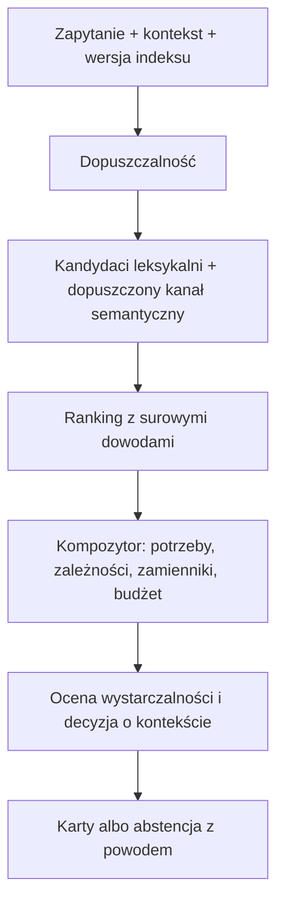

# E1.3: przegląd biblioteki badań i architektura po testach

**Stan:** 2026-09-05. **Ocena:** można udostępniać z ograniczeniami; wybór nowego modelu wymaga poprawnego, niezależnego testu.
**Kod odniesienia:** historyczny `c2cc81219bda11a267bea3c04c1e8128c9c0a920` i naprawiony kod runtime z `c08c58c09c5a2aaa61cc9a0bbd2891d41e43c365` (także w późniejszym dokumentacyjnym `757d4f0`). W trakcie audytu zmiany z `gf-adr22` zostały scalone do main; worktree usunięto.
**Dowody:** [manifest źródeł](validation/papers-manifest-2026-09-05.json), [pierwsza recenzja](E1.3-peer-review-2026-09-05.md), [audyt kontraktów](validation/router-contract-review-2026-09-05.json), [plan zamknięcia E1](E1-closure-plan.md).

## 1. Decyzja produktowa

Zachować szybki lokalny router leksykalny. Najpierw zapewnić poprawność obliczeń i zgodność benchmarku z produktem, następnie poprawić dopuszczalność i kompletowanie zestawu instrukcji. Dense i reranker pozostają opcjami ocenianymi na dopuszczalnych kandydatach i przy rzeczywistym budżecie kontekstu.

Własny fine-tuning nie jest jedyną wiarygodną drogą powrotu: poprawne wejście, dodatkowe pokrycie kandydatów, inny checkpoint lub lepszy student również są hipotezami do zbadania. Historyczny wynik opisuje konkretne konfiguracje; nie dowodzi, że badania nie pomagają.

[ADR-0022](../../adr/ADR-0022-admissibility-relevance-and-bundle-completeness.md) został dodany do main w c08c58c wraz z pierwszymi trzema poprawkami; jego status pozostaje Proposed. Ten raport uzupełnia istniejącą decyzję o pełny przegląd źródeł i korekty interpretacyjne. Nie utworzono konkurencyjnego ADR.

## 2. Pokrycie wszystkich lokalnych materiałów

Aktualny snapshot zawiera **16 plików, 14 unikalnych treści i 11 różnych źródeł**: 10 publikacji oraz README/repozytorium Model2Vec. Wcześniejszy odczyt obejmował 12 plików i 9 źródeł; później dodano GoS, SkillResolve i dwie kopie już istniejących pełnych tekstów. Manifest zawiera dokładne nazwy, SHA-256, rozmiary, wersje, źródłowe URL i ograniczenia.

| Lokalny materiał | Faktyczna zawartość i zakres sprawdzenia |
|---|---|
| BM25 Robertson 2009 | Pełny PDF; odczytane sekcje BM25/BM25F, kalibracji i optymalizacji; sprawdzona strona 364 z równaniami. |
| BEIR, DPR, monoBERT | Lokalne strony abstract; uzupełnione pełnymi tekstami odpowiednio v4, v3 i v5. |
| SkillRouter i SkillRet | Abstract oraz pełne teksty v5 i v3; dodatkowe nazwane kopie są identyczne bajtowo z odpowiednimi `full-*`. |
| RRF | Lokalny plik 279 B jest HTML-em błędu 404; przeczytano obie strony właściwego PDF autorów. |
| SIF | Lokalny HTML jest stroną weryfikacji przeglądarki. Pełny finalny PDF pozostał niedostępny; sprawdzono kod i obszerny opis autora. |
| Model2Vec | GitHub README ze snapshotu `94cbc1b1ee36cec0f462a0b142a041e1af488203`, oficjalne wyniki i dokumentacja. To nie osobna recenzowana publikacja. |
| GoS i SkillResolve | Pełne lokalne teksty v3 i v1, metody, wyniki i dodatki. |
| `fetch.sh` | Odczytany i zahaszowany, niewykonywany. Błędny adres RRF zawiera `gvcormack` zamiast `gvcormac`. |

Pełne kopie publikacji pozostają poza repo. W repo zapisujemy własną analizę i cytowania; licencja Guidefold nie ustanawia licencji cudzych publikacji.

## 3. Wnioski z każdego źródła

### BM25/BM25F

Robertson i Zaragoza opisują prosty wariant agregujący ważone pola oraz wariant normalizujący każde pole przed nasyceniem. Historyczny B1 i CLI stosują różne warianty; B1 nie jest przez to błędnym BM25. Odrębny błąd skali dotyczy CLI. Wagi pól i parametr nasycenia są współzależne. **Zastosowanie:** jeden zadeklarowany scorer, referencja zmiennoprzecinkowa i jawna skala wag. [Pełny tekst autorów](https://www.staff.city.ac.uk/~sbrp622/papers/foundations_bm25_review.pdf).

### DPR

DPR bada uczone encodery kontekstowe do fragmentów odpowiedzi, nie statyczną tabelę słów. Wyniki obejmują przegraną z BM25 na SQuAD i mieszane efekty hybrydy. **Zastosowanie:** mierzyć dodatkowe potrzebne skille w unii kandydatów oraz końcowe wykonanie zadania. Wynik teachera nie jest wynikiem studenta. [DPR v3](https://arxiv.org/html/2004.04906v3).

### BEIR

BM25 jest mocnym baseline'em, ale BM25 z cross-encoderem wygrywa z nim na 16 z 18 zbiorów. Audyt brakujących ocen TREC-COVID zmienia porównanie: ANCE rośnie z 0,654 do 0,735, powyżej BM25 0,668. Appendix B wyłącza pełny problem recency/authority i rozbudowanej wielopolowości. **Zastosowanie:** oceniać nowe trafienia różnych retrieverów i oddzielać policy od tekstowej relevance. [BEIR v4](https://arxiv.org/html/2104.08663v4).

### monoBERT

Cross-encoder porządkuje istniejących kandydatów pierwszego etapu. Praca nie ustanawia gwarancji kompletności zestawu, abstencji ani latencji hooka. **Zastosowanie:** identyczne dopuszczalne listy, zapis faktycznego wejścia i osobna bramka kosztu. [monoBERT v5](https://arxiv.org/html/1901.04085v5).

### RRF

RRF sumuje odwrotności rang; parametr 60 wybrano w pilocie i zamrożono. Przy jednej liście top-1 stale otrzymuje 1/61, niezależnie od siły dopasowania. Wąski zakres wartości sam w sobie nie dowodzi niemożliwości thresholdingu. **Zastosowanie:** zachować surowe dowody i osobno kalibrować decyzję o kontekście. [RRF, PDF autorów](https://plg.uwaterloo.ca/~gvcormac/cormacksigir09-rrf.pdf).

### SIF

Kod i opis autora potwierdzają ważenie `a/(a+p(w))` oraz usunięcie głównego kierunku wyznaczonego na reprezentacjach zdań. To nie dowolne PCA na słowach. Materiały przedstawiają mocny prosty baseline, nie dowód koniecznej porażki na sibling ambiguity. **Zastosowanie:** oddzielne ablacje ważenia, projekcji i agregacji. Ograniczenie: pełny finalny PDF nie został odczytany. [Kod autorów](https://github.com/PrincetonML/SIF), [opis Sanjeeva Arory](https://www.offconvex.org/2018/06/17/textembeddings/).

### Model2Vec

Dokumentacja wskazuje, że lepszy teacher na MTEB nie zawsze daje lepszego studenta. Istotne są vocabulary, pooling, PCA i kwantyzacja. Nasza implementacja nie jest automatycznie reprodukcją całego Model2Vec; straty teacher–student nie można przypisać wyłącznie int8. **Zastosowanie:** kontrolowane etapy kompresji, pomiar OOV i zgodność przestrzeni query/document. [Dokumentacja autorów](https://minish.ai/packages/model2vec/distillation/).

### SkillRouter

V5 potwierdza stratę 37–44 pp po ukryciu body. Nie wyznacza to wag BM25. Główny test ma 75 zweryfikowanych zapytań, dodatkowy 256 generowanych przez LLM. Lepszy Hit@1 nie oznacza najlepszej kompletności. Wśród zadań multi występują składniki komplementarne, zamienniki i mieszane potrzeby. Cztery źródła hard negatives dotyczą treningu, nie gotowego protokołu niezależnego golden setu. **Zastosowanie:** dostęp do body, kontrola obcięcia, audyt false negatives, AND między potrzebami i OR między potwierdzonymi zamiennikami. [SkillRouter v5](https://arxiv.org/html/2603.22455v5).

### SkillRet

V3 opisuje 16 129 skilli, w tym 6006 w puli ewaluacyjnej, i 4392 zapytania ewaluacyjne. Po audycie funkcjonalnych duplikatów i nakładania się danych NDCG@10 wynosi: BM25 51,69, SkillRouter encoder 0.6B 73,54, SkillRet 0.6B 81,12. Osobny Terminal-Bench porównuje **brak retrieval z SkillRet**, dając 65,5% i 65,8% sukcesu. Nie mierzy transferu różnicy BM25–SkillRet z tabeli NDCG. **Zastosowanie:** odpowiedniki, niezależne zadania, oddzielenie jakości puli od rankera oraz własny test downstream. [SkillRet v3](https://arxiv.org/html/2605.05726v3).

### Graph of Skills

GoS łączy seeding, propagację i paczki. Przy 1000 skillach ablacja daje reward 34,4 dla całości i 29,3 bez propagacji. Usunięcie lexical retrieval i rerankingu razem nie izoluje rerankera; opisany reranking nie jest neural cross-encoderem. Dwa powtórzenia, brak formalnego testu istotności i wynik przy 200 skillach ograniczają uogólnienie. **Zastosowanie:** porównać wymagane domknięcie z PPR przy identycznym budżecie, bez automatycznego wdrażania propagacji. [GoS v3](https://arxiv.org/html/2604.05333v3).

### SkillResolve

Benchmark ma 661 kontrolowanych par helpful/risky w puli 7982 skilli. Bez wyboru reprezentanta Recall@3 pozostaje blisko pełnego systemu (0,762 wobec 0,766), ale HSR rośnie do 0,236. HSR mierzy ekspozycję, nie końcową szkodę. Główna tabela używa udostępnionej relacji rodzin i uczonego scorera, a część baseline'ów działa zero-shot. Wpływ cech kontraktów ma przedział niepewności obejmujący zero. **Zastosowanie:** osobno mierzyć potrzebną zdolność i właściwego reprezentanta. One-per-family stosować tylko do zweryfikowanych zamienników, nigdy do komplementarnych zależności. [SkillResolve v1](https://arxiv.org/html/2606.10388v1).

## 4. Nasze pomiary: zakres i mianowniki

Poniższe liczby dotyczą historycznego B1 lub eksperymentu diagnostycznego, nie automatycznie poprawionego CLI.

| Pomiar | Wynik | Znaczenie |
|---|---:|---|
| B1 multi: historyczne completeness@4 | 63/66 = 95,45% | Obecność primary, bez wszystkich wymaganych companions. |
| B1 multi: wszystkie grade >= 2 w top4 | 49/66 = 74,24% | Komplet zgodny z istniejącymi etykietami. |
| B1 multi: strict primary@1 | 39/66 = 59,09% | Inny cel niż dowolne istotne trafienie. |
| B1 Recall@8 | 97,9885% | Historyczna bramka +3 pp była nieosiągalna; już wycofana w c2cc812. |
| B5/B6, 20 answerable stale | 15/20 vs 10/20 Hit@1 | Historyczny spadek 25 pp. |
| Te same ocenione listy po filtrze deprecated | 16/20 vs 15/20 | Spadek maleje do 5 pp; filtr ma mierzalny wpływ. |
| B6 po filtrze i z pełnym body | 16/20 | Równa suma trafień nie oznacza tych samych przypadków ani generalizacji. |

Źródła: [audyt B1](validation/e13-review-data.json), [eksperyment rerankera](validation/e13-reranker-review-data.json). Filtr usuwał deprecated z top20 bez uzupełniania; nie odtwarzał całego pipeline'u.

Body sweep dał Hit@1 78,16 → 87,36 → 85,63 → 82,76 → 80,46% przy wagach 0/1/2/3/6. To eksploracja B1, nie niezależny wybór wag dla poprawionego CLI. Około 66,9% ważonej masy tokenów body w B1 nie jest udziałem w końcowym score.

46 przypadków powinno powodować abstencję. Niezdefiniowane nDCG nie oznacza braku wyniku produktu: błędne wstrzyknięcie pozostaje mierzalne. Warm scoring B6 miał medianę 314 ms i p95 342 ms; pełne body medianę 595 ms i niestabilny ogon. Nie przenosić kosztu krótszego wejścia na pełne ani throughputu batcha na latencję użytkownika.

## 5. Stan napraw i uwagi do istniejącego ADR-0022

Na c2cc812 cosine jest już naprawione, `all_required@4` dodane obok starej serii, a niemożliwa bramka wycofana. Próby CPU potwierdziły na tej historycznej wersji błąd jednostek BM25, ignorowanie `w_dense=0` przy niepustej tablicy i wprowadzanie zależności odrzuconych przez policy. Na c08c58c te trzy kontrakty przechodzą audyt; cosine przechodzi 1000 losowych porównań w obu wersjach. [Skrypt audytu](../../../tools/eval/audit_router_contract.py) i [wyniki z fingerprintami](validation/router-contract-review-2026-09-05.json) rozróżniają przypięty historyczny baseline i aktualny scalony kod wraz z SHA-256 pliku CLI.

Naprawy z gf-adr22 zostały scalone do main jako c08c58c. W aktualnej wersji route/find przekazują dopuszczalny zbiór do select; wykluczona zależność jest pomijana. Pełny kompozytor z jawnym unresolved/cannot-fit pozostaje dalszą pracą. Bezpośrednie wywołanie select z opcjonalnym `admissible=None` nie ustanawia globalnego niezmiennika API.

Uwagi znalezione w szkicu ADR i planie zamknięcia, uwzględnione w korektach dokumentacji towarzyszących temu raportowi:

1. Błąd BM25 dotyczy CLI, nie historycznego float B1. Zdanie „Every BM25 number” jest zbyt szerokie.
2. Odczytany szkic podawał zarówno „65% incomplete”, jak i „0.65 completeness”. Podać licznik, mianownik i wersję pomiaru; nie zastępować ich historycznym 74,24% B1.
3. Nie deklarować niezmienionej latencji ani kosztu w mikrosekundach bez pomiaru po zmianie.
4. `similar` nie dowodzi funkcjonalnej zamienności. Alternatywa wymaga osobnej weryfikacji.
5. Runtime zna deklarowane zależności i rozpoznane potrzeby, nie oracle qrels. Domknięcie requires nie dowodzi kompletności całego zadania.
6. Non-inferiority wymaga ustalonego marginesu i niepewności. Bramka latencji musi wskazywać kwantyl zgodny z kontraktem produktu.

## 6. Kontrakt architektoniczny do zastosowania

To nasza synteza inżynierska, nie system dowiedziony jako całość w jednej pracy.



**Dopuszczalność:** wspólna policy dla kandydatów, rerankera i zależności. Zachować aktualny kontrakt scope; wyjątek między gałęziami musi być jawny. Przypadkowe obejście filtra nie jest wyjątkiem biznesowym.

**Ranking:** scorer z referencją matematyczną, wersją i deterministycznymi remisami. Zachować matched terms/fields, raw scores i źródła kandydatów. Korpus statystyczny IDF/normalizacji i jego wersja są jawne; filtr per-query nie zmienia ich niejawnie.

**Kompozycja:** AND między niezależnymi potrzebami, OR wyłącznie między zweryfikowanymi zamiennikami, pełne transitive requires, współdzielone prerequisites, wykrywanie cykli oraz atomowa kontrola kart/tokenów. Odróżniać domknięcie deklarowanych zależności od kompletności zadania mierzonej w ewaluacji. Brak, wykluczenie i przekroczenie budżetu mają jawne powody; general→specific to kolejność prezentacji, nie relevance.

**Abstencja:** osobna wersjonowana reguła kalibrowana na dev; false injection, false abstention, HSR i coverage z pełnymi mianownikami. Heurystyka nie jest skalibrowanym prawdopodobieństwem.

**Modele:** przyrost wymaganych kandydatów przed zmianą rankingu. Teacher, student i reranker jako osobne profile. Hook pozostaje lokalnym skryptem stdlib + PyYAML; obecność cache nie wybiera niejawnie innego algorytmu.

**Artefakty:** content hash, revision modelu/tokenizera, instruction/template, truncation, pooling, normalization, projection, weighting, quantization i compiler version. Vocabulary z korpusu czyni artefakt zależnym od korpusu. Równe wymiary nie dowodzą zgodnej przestrzeni wektorów.

**Skalowanie:** sharding po profilu, z opisem IDF i wymaganych zależności między shardami. PPR po porównaniu z domknięciem przy identycznym budżecie, a nie wyłącznie na podstawie publikacji.

## 7. Kolejność prac i kryteria zakończenia

| Etap | Praca | Kryterium zakończenia |
|---|---|---|
| 1 | Dokończyć jednostki BM25, zero-weight i policy. | Referencje matematyczne, testy wykluczeń, wersja scorera i nowy baseline; osobno main i overlay. |
| 2 | Benchmark korzysta z produkcyjnych etapów. | Zgodne dopuszczalne zbiory, scores, rankingi i karty; zapis per query, fingerprinty i mianowniki. |
| 3 | Kompozytor. | Testy AND/OR, zależności, cykli, braków i budżetu; końcowe all-required obok candidate recall. |
| 4 | Niezależny test i abstencja. | Realne zadania, podział po repo/rodzinie, audyt odpowiedników, zamrożone kryteria przed testem. |
| 5 | Ablacje dodatkowych kanałów. | Sparse, contextual candidate union, reranker i studenci przy wspólnym budżecie/policy; jeden zmieniony czynnik na ablację. |
| 6 | Test wykonania. | Bez skilli, selected, oracle i wrong-sibling: sukces, naruszenia, koszt, tokeny, czas. |
| 7 | Skalowanie i ewentualny trening. | Nazwany problem jakości/zasobów oraz poprawa na niezależnym teście. Owner acceptance propozycji nie zastępuje query-relevance labels. |

Stare 220 przypadków pozostaje dev/regression. Etykiety rozróżniają required, alternative, optional, harmful i unjudged. Nowe trafienia oceniać bez ujawniania modelu. Zachować historyczne serie grade-3 i grade>=2, nie przepisywać historii.

Przed testem ustalić minimalną istotną korzyść, margines non-inferiority i tolerancję harmful/null błędów. Stosować sparowane porównania i bootstrap grupowany po niezależnych rodzinach; parafrazy nie są niezależnymi obserwacjami. Brak istotności nie dowodzi równoważności.

Jeśli nawet eligible oracle bundle nie pomaga, najpierw sprawdzić treść skilli i sposób użycia. Niższy koszt przy wykazanej non-inferiority sukcesu także może być wartościową poprawą; wzrost samego success nie jest jedynym możliwym celem produktu.

## 8. Ograniczenia i dostarczenie

Mały fixture, syntetyczne pytania w części badań, niepełne etykiety i różne budżety ograniczają transfer. SIF pozostaje zweryfikowany przez materiały autorów bez pełnego finalnego PDF. Manifest rozróżnia pliki od niezależnych źródeł.

Ten raport zapisuje analizę, korekty istniejącego ADR i testowalny plan. Pierwsze poprawki runtime wdrożyła równoległa zmiana c08c58c; audyt potwierdza ich działanie i 21 testów kontraktowych przeszło na scalonej wersji. Sam zapis raportu nie oznacza zatwierdzenia całego ADR-0022 ani ukończenia kompozytora. Wcześniejsza blokada dostępu nie dotyczy już zapisu tego dokumentu.

Odtworzenie audytu CPU z katalogu repozytorium:

```bash
python3 tools/eval/audit_router_contract.py --baseline-ref c2cc81219bda11a267bea3c04c1e8128c9c0a920 --compare-root . --out /tmp/router-contract-review.json
```

Ukierunkowana walidacja scalonych poprawek: `tests/test_bm25_reference.py`, `tests/test_router_candidates.py`, `tests/test_router_select.py` — 21 testów, wszystkie przeszły. Nie jest to test skuteczności nowego modelu ani pomiar latencji.
