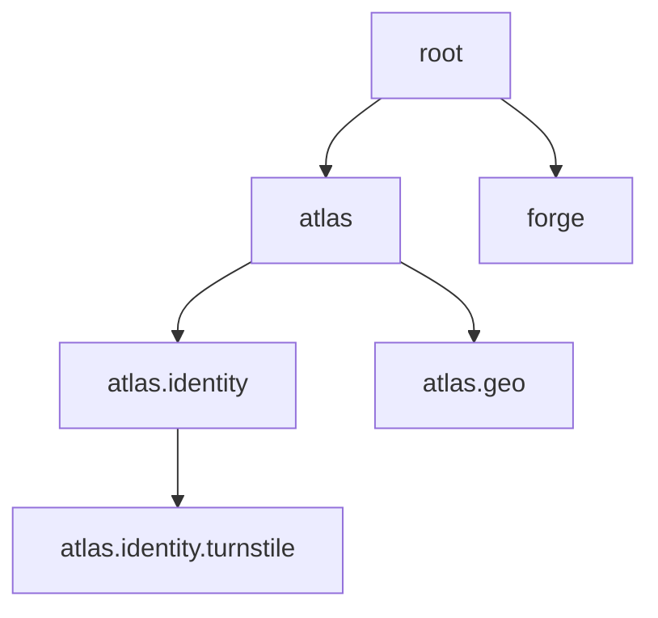
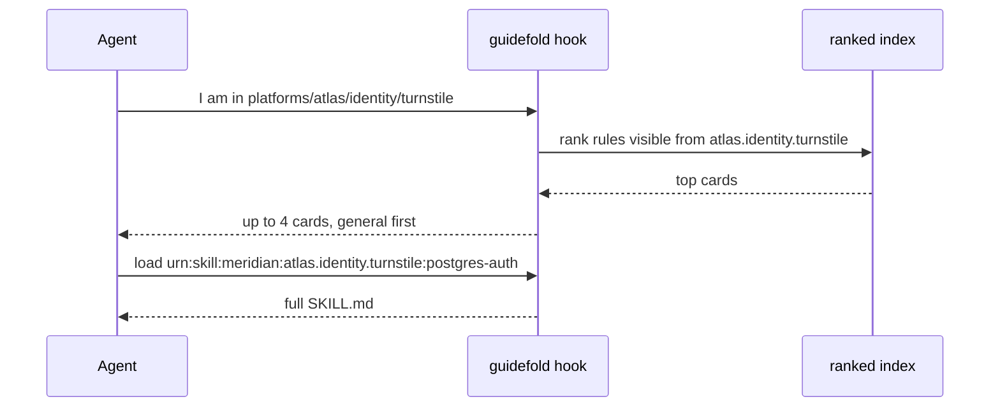

## The tree

Your monorepo already has a shape: platforms, then services, then teams. Guidefold reads that shape from one file at the root, `guidefold.yaml`. Each line names a scope and the folders it covers.

```yaml
publisher: meridian
nodes:
  _root:            { paths: ["**"],                          owner: platform-engineering }
  atlas:            { paths: ["platforms/atlas/**"],          owner: atlas-platform }
  atlas.identity:   { paths: ["platforms/atlas/identity/**"], owner: identity-platform }
  atlas.identity.turnstile:
                    { paths: ["platforms/atlas/identity/turnstile/**"], owner: turnstile-team }
```

Dots make the tree. `atlas.identity.turnstile` sits under `atlas.identity`, which sits under `atlas`, which sits under the root.



## The rules

A rule is a folder with one file, `SKILL.md`, under `.agents/skills/` inside the scope it belongs to. The top of the file is a short card: a name, one sentence, a two-line summary, a few trigger phrases, and the owner. The rest is the full text.

```
platforms/atlas/identity/turnstile/.agents/skills/postgres-auth/SKILL.md
```

The card is what an agent sees first. The full text is what it reads when the card is not enough.

## What an agent gets

When an agent starts work in a folder, a small hook runs. It finds the scope of that folder, ranks every rule the scope can see (its own subtree plus the chain above it), and prints at most four cards. The agent then loads the full text of the one or two it needs.



Cards come general first, specific last. If a scope above has a map of what lives there, that map comes first.

## Why cards, not whole files

Other tools paste every matching file into the prompt until it does not fit, then cut. Guidefold sends short cards and lets the agent ask for more. We measured this on 75 tasks across 70 real rules: an agent that only saw the card correctly asked for the full text 97% of the time when it needed it, and never asked when it did not. See [Evidence](/evidence).

## Up the tree

When a rule changes in a team folder, Guidefold can write a short summary one level up: what lives in that scope, who owns each part, and what all the teams there do the same way. It keeps climbing until a level has nothing general to add. Every sentence of that summary points at the rule it came from, and the owner of the higher scope reviews it as a pull request. See [Knowledge ascent](/knowledge-ascent).

## Before merge

A pull request that touches a rule gets a report: which rules were added or changed, whether two rules now answer the same question, whether a dependency is missing, and what an agent would see for a set of example questions. Structure problems block the merge. Everything else warns.

## Numbers

Every card an agent saw, every full text it loaded, and every judgement a person gave is recorded as an event. Missing data stays missing; it is never shown as zero. See [Telemetry](/telemetry).
