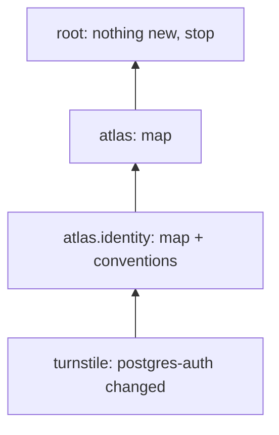

A team writes a rule for its own service. Often part of that rule is true for the whole platform: which service does authorization, what every pipeline names its topics, who owns what. Left alone, that knowledge stays in one folder and every other team rediscovers it.

Guidefold can lift it. When a rule changes in a leaf scope, a model reads the cards of everything under the parent scope and writes, or edits, one short summary there. Then it looks one level higher and does the same, until a level has nothing general to add.



## Two kinds of summary

A map says what lives in a scope: the child scopes, what each is for, who owns it, how they connect. It is for an agent that lands anywhere below and needs to know what else exists around it.

A convention says what every child does the same way. It is written only when at least two children genuinely share it.

Both are ordinary rule files with a fixed name, `<scope>-map` and `<scope>-conventions`, marked as generated and listing the rules they came from.

## What the model sees

For one level, the model gets the scope's owner and children, the summary that already exists there (to edit, never to duplicate), the cards of every rule below, and the full text of only the rule that changed. It never sees the whole repository.

## The gates

Nothing is written unless all of these hold.

- Every claim names the rule it came from, and that rule is in the context.
- The text names no service, team or rule that is not in the context.
- The text has no code block, no numbered steps and no three lines copied from a rule below. A summary is a digest, not a procedure.
- The file is at most 80 lines.
- `guidefold validate` still passes with the new file.

A summary also records a fingerprint of the cards it was built from. If nothing below changed, the next run makes no model call and no diff.

Why so strict: in the research this design follows, summaries generated without grounding in existing rules made agents worse than having no summaries at all. Grounding is the whole point.

## How it reaches an agent

The hook prints the nearest map above the best card, first. The files `materialize` writes open with a "Scope map" section. Ranking does not change; the map is an extra card, not a promoted one.

## Where it runs

In your CI, on a pull request that changes a rule. Copy `templates/ci.yml` and set one secret:

| Setting | Where | Value |
|---|---|---|
| `GUIDEFOLD_ASCEND_API_KEY` | repository secret | key for an OpenAI-compatible endpoint (OpenRouter by default) |
| `GUIDEFOLD_ASCEND_MODEL` | repository variable | model id, for example `anthropic/claude-sonnet-4.5` |
| `GUIDEFOLD_ASCEND_BASE_URL` | repository variable | leave empty for OpenRouter |

Without the secret the job skips itself. With it, the job opens a separate pull request against your base branch. It never pushes to the branch that triggered it. The reviewers are whoever `CODEOWNERS` names for the parent folder. That is the human gate.

You can run the same thing locally:

```bash
python3 .agents/skills/guidefold/scripts/guidefold ascend --since origin/main --dry-run
```

`--dry-run` shows the climb plan and calls no model.

## Without editing your CI

If you installed the Guidefold GitHub App, the hosted service can do this for you on every pull request: it clones the commit, runs the same command, and opens the same pull request. The contract for that is written; the code is in progress. Until it ships, use the CI job above.
